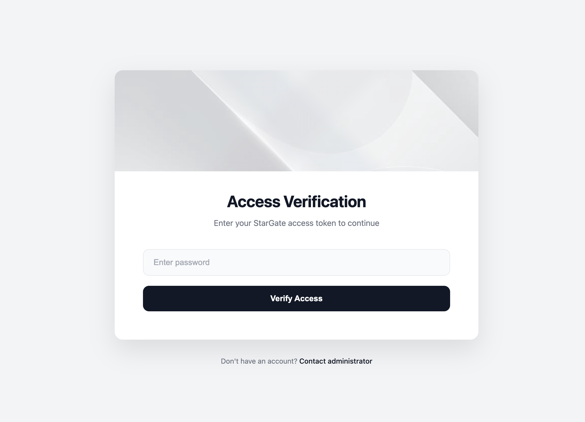

# Stargate - Forward Auth Service

[](LICENSE)
[](https://golang.org)
[](https://codecov.io/gh/soulteary/stargate)
[](https://goreportcard.com/report/github.com/soulteary/stargate)

> **🚀 Il Tuo Gateway verso Microservizi Sicuri**


Stargate è un servizio di autenticazione forward pronto per la produzione, leggero, progettato per essere il **punto di autenticazione unico** per tutta la tua infrastruttura. Costruito con Go e ottimizzato per le prestazioni, Stargate si integra perfettamente con Traefik e altri proxy inversi per proteggere i tuoi servizi backend—**senza scrivere una sola riga di codice di autenticazione nelle tue applicazioni**.

## 🌐 Documentazione Multilingue

- [English](README.md) | [中文](README.zhCN.md) | [Français](README.frFR.md) | [Italiano](README.itIT.md) | [日本語](README.jaJP.md) | [Deutsch](README.deDE.md) | [한국어](README.koKR.md)



### 🎯 Perché Stargate?

Stanco di implementare la logica di autenticazione in ogni servizio? Stargate risolve questo problema centralizzando l'autenticazione al bordo, permettendoti di:

- ✅ **Proteggere più servizi** con un unico strato di autenticazione
- ✅ **Ridurre la complessità del codice** rimuovendo la logica di autenticazione dalle tue applicazioni
- ✅ **Distribuire in pochi minuti** con Docker e una configurazione semplice
- ✅ **Scalare senza sforzo** con un'impronta di risorse minima
- ✅ **Mantenere la sicurezza** con più algoritmi di crittografia e gestione sicura delle sessioni

### 💼 Casi d'Uso

Stargate è perfetto per:

- **Architettura di Microservizi**: Proteggere più servizi backend senza modificare il codice dell'applicazione
- **Applicazioni Multi-Dominio**: Condividere sessioni di autenticazione tra diversi domini e sottodomini
- **Strumenti Interni e Dashboard**: Aggiungere rapidamente l'autenticazione a servizi interni e pannelli di amministrazione
- **Integrazione Gateway API**: Utilizzare con Traefik, Nginx o altri proxy inversi come strato di autenticazione unificato
- **Sviluppo e Test**: Autenticazione semplice basata su password per ambienti di sviluppo
- **Autenticazione Aziendale**: Integrazione con Warden (whitelist utenti) e Herald (OTP/codici di verifica) per autenticazione di livello produzione

## ✨ Funzionalità

### 🔐 Sicurezza di Livello Aziendale

- **Più Algoritmi di Crittografia Password**: Scegli tra plaintext (test), bcrypt, MD5, SHA512 e altro ancora
- **Gestione Sicura delle Sessioni**: Sessioni basate su Cookie con dominio e scadenza personalizzabili
- **Autenticazione Flessibile**: Supporto per autenticazione basata su password e basata su sessione
- **Supporto OTP/Codice di Verifica**: Integrazione con il servizio Herald per codici di verifica SMS/Email
- **Gestione Whitelist Utenti**: Integrazione con il servizio Warden per il controllo di accesso utente

### 🌐 Capacità Avanzate

- **Condivisione Sessioni Cross-Domain**: Condividere perfettamente le sessioni di autenticazione tra diversi domini/sottodomini
- **Supporto Multilingue**: Interfacce integrate in inglese e cinese, facilmente estendibili per più lingue
- **Interfaccia Personalizzabile**: Personalizza la tua pagina di login con titoli e testi di piè di pagina personalizzati

### 🚀 Prestazioni e Affidabilità

- **Leggero e Veloce**: Costruito su Go e il framework Fiber per prestazioni eccezionali
- **Utilizzo Minimo delle Risorse**: Impronta di memoria ridotta, perfetto per ambienti containerizzati
- **Pronto per la Produzione**: Architettura testata in battaglia progettata per l'affidabilità

### 📦 Esperienza Sviluppatore

- **Docker First**: Immagine Docker completa e configurazione docker-compose pronte all'uso
- **Traefik Nativo**: Integrazione middleware Traefik Forward Auth a zero configurazione
- **Configurazione Semplice**: Configurazione basata su variabili d'ambiente, nessun file complesso necessario

## 📋 Indice

- [Avvio Rapido](#-avvio-rapido)
- [Documentazione](#-documentazione)
- [Configurazione di Base](#-configurazione-di-base)
- [Integrazione Servizi Opzionali](#-integrazione-servizi-opzionali)
- [Checklist Produzione](#-checklist-produzione)
- [Licenza](#-licenza)

## 🚀 Avvio Rapido

Metti Stargate in funzione in **meno di 2 minuti**!

### Utilizzo di Docker Compose (Consigliato)

**Passo 1:** Clona il repository
```bash
git clone <repository-url>
cd stargate
```

**Passo 2:** Configura la tua autenticazione (modifica `docker-compose.yml`)

**Opzione A: Autenticazione Password (Semplice)**
```yaml
services:
  stargate:
    environment:
      - AUTH_HOST=auth.example.com
      - PASSWORDS=plaintext:yourpassword1|yourpassword2
```

**Opzione B: Autenticazione OTP Warden + Herald (Produzione)**
```yaml
services:
  stargate:
    environment:
      - AUTH_HOST=auth.example.com
      - WARDEN_ENABLED=true
      - WARDEN_URL=http://warden:8080
      - WARDEN_API_KEY=your-warden-api-key
      - HERALD_ENABLED=true
      - HERALD_URL=http://herald:8080
      - HERALD_HMAC_SECRET=your-herald-hmac-secret
```

**Passo 3:** Avvia il servizio
```bash
docker-compose up -d
```

**Ecco fatto!** Il tuo servizio di autenticazione è ora in esecuzione. 🎉

### Sviluppo Locale

Per lo sviluppo locale, assicurati che Go 1.26+ sia installato, poi:

```bash
chmod +x start-local.sh
./start-local.sh
```

Accedi alla pagina di login a `http://localhost:8080/_login?callback=localhost`

## 📚 Documentazione

È disponibile una documentazione completa per aiutarti a sfruttare al meglio Stargate:

### Documenti Principali

- 📐 **[Documento Architettura](docs/itIT/ARCHITECTURE.md)** - Approfondimento sull'architettura tecnica e decisioni di progettazione
- 🔌 **[Documento API](docs/itIT/API.md)** - Riferimento completo degli endpoint API con esempi
- ⚙️ **[Riferimento Configurazione](docs/itIT/CONFIG.md)** - Opzioni di configurazione dettagliate e best practice
- 🚀 **[Guida al Deployment](docs/itIT/DEPLOYMENT.md)** - Strategie di deployment in produzione e raccomandazioni

### Riferimento Rapido

- **Endpoint API**: `GET /_auth` (verifica auth), `GET /_login` (pagina login), `POST /_login` (login), `POST /_send_verify_code` (invia OTP), `GET /_logout` (logout), `GET /_session_exchange` (cross-domain), `GET /totp/enroll`, `POST /totp/enroll/confirm`, `GET /totp/revoke`, `POST /totp/revoke` (TOTP se Herald abilitato), `GET /health` (salute), `GET /metrics` (Prometheus)
- **Deployment**: Docker Compose consigliato per avvio rapido. Vedi [DEPLOYMENT.md](docs/itIT/DEPLOYMENT.md) per il deployment in produzione.
- **Sviluppo**: Per la documentazione relativa allo sviluppo, vedi [ARCHITECTURE.md](docs/itIT/ARCHITECTURE.md)

## ⚙️ Configurazione di Base

Stargate utilizza variabili d'ambiente per la configurazione. Ecco le impostazioni più comuni:

### Configurazione Richiesta

- **`AUTH_HOST`**: Nome host del servizio di autenticazione (ad esempio, `auth.example.com`)
- **`PASSWORDS`**: Configurazione password, formato: `algorithm:password1|password2|password3`

### Esempi di Configurazione Comuni

```bash
# Autenticazione password semplice
AUTH_HOST=auth.example.com
PASSWORDS=plaintext:test123|admin456

# Utilizzo hash BCrypt
PASSWORDS=bcrypt:$2a$10$N9qo8uLOickgx2ZMRZoMyeIjZAgcfl7p92ldGxad68LJZdL17lhWy

# Condivisione sessioni cross-domain
COOKIE_DOMAIN=.example.com

# Personalizza pagina di login
LOGIN_PAGE_TITLE=Il Mio Servizio di Autenticazione
LANGUAGE=it  # o 'en'
```

**Algoritmi password supportati:** `plaintext` (solo test), `bcrypt`, `md5`, `sha512`

**Per la configurazione dettagliata, vedere: [docs/itIT/CONFIG.md](docs/itIT/CONFIG.md)**

## 🔗 Integrazione Servizi Opzionali

Stargate può essere utilizzato completamente in modo indipendente, o può opzionalmente integrarsi con i seguenti servizi:

### Integrazione Warden (Whitelist Utenti)

Fornisce la gestione della whitelist utenti e le informazioni utente. Quando abilitata, Stargate interroga Warden per verificare se un utente è nell'elenco consentito.

```bash
WARDEN_ENABLED=true
WARDEN_URL=http://warden:8080
WARDEN_API_KEY=your-api-key
```

### Integrazione Herald (OTP/Codici di Verifica)

Fornisce servizi OTP/codici di verifica. Quando abilitata, Stargate chiama Herald per creare, inviare e verificare codici di verifica (SMS/Email).

```bash
HERALD_ENABLED=true
HERALD_URL=http://herald:8080
HERALD_HMAC_SECRET=your-hmac-secret  # Produzione
# o
HERALD_API_KEY=your-api-key  # Sviluppo
```

**Nota:** Entrambe le integrazioni sono opzionali. Stargate può essere utilizzato indipendentemente con autenticazione password.

**Guida integrazione completa, vedere: [docs/itIT/ARCHITECTURE.md](docs/itIT/ARCHITECTURE.md)**

## ⚠️ Checklist Produzione

Prima di distribuire in produzione:

- ✅ Utilizzare algoritmi password forti (`bcrypt` o `sha512`, evitare `plaintext`)
- ✅ Abilitare HTTPS via Traefik o il tuo proxy inverso
- ✅ Impostare `COOKIE_DOMAIN` per una gestione sessione appropriata tra sottodomini
- ✅ Per funzionalità avanzate, integrare opzionalmente Warden + Herald per l'autenticazione OTP
- ✅ Utilizzare firme HMAC o mTLS per la comunicazione Stargate ↔ Herald/Warden
- ✅ Configurare registrazione e monitoraggio appropriati
- ✅ Mantenere Stargate aggiornato all'ultima versione

## 🎯 Principi di Progettazione

Stargate è progettato per essere utilizzato in modo indipendente:

- **Utilizzo Autonomo**: Stargate può funzionare indipendentemente utilizzando la modalità di autenticazione password, senza dipendenze esterne
- **Integrazione Opzionale**: Può opzionalmente integrarsi con Warden (whitelist utenti) e Herald (OTP/codici di verifica)
- **Alte Prestazioni**: Il percorso principale forwardAuth verifica solo la sessione, garantendo una risposta rapida
- **Flessibilità**: Supporta più modalità di autenticazione, scegli in base alle tue esigenze

## 📝 Licenza

Questo progetto è concesso in licenza sotto Apache License 2.0. Vedi il file [LICENSE](LICENSE) per i dettagli.

## 🤝 Contribuire

Accogliamo i contributi! Che siano:
- 🐛 Segnalazioni di bug
- 💡 Suggerimenti di funzionalità
- 📝 Miglioramenti alla documentazione
- 🔧 Contributi di codice

Sentiti libero di aprire un Issue o inviare una Pull Request.
