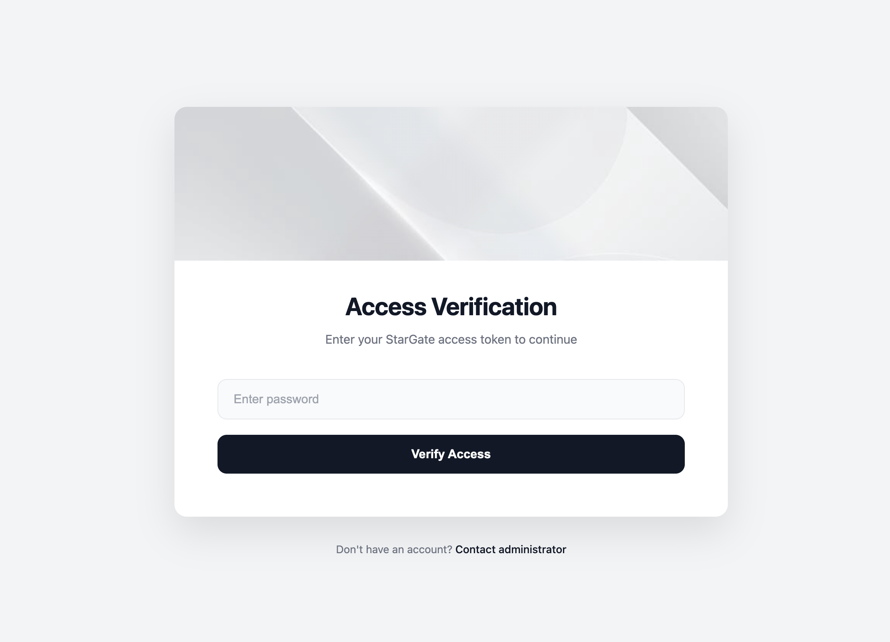

# Stargate - Forward Auth Service

[](LICENSE)
[](https://golang.org)
[](https://codecov.io/gh/soulteary/stargate)

> **🚀 보안 마이크로서비스로의 게이트웨이**

Stargate는 전체 인프라의 **단일 인증 지점**이 되도록 설계된 프로덕션 준비가 된 경량 Forward Auth 서비스입니다. Go로 구축되고 성능에 최적화된 Stargate는 Traefik 및 기타 리버스 프록시와 원활하게 통합되어 백엔드 서비스를 보호합니다—**애플리케이션에 인증 코드를 한 줄도 작성할 필요가 없습니다**.

## 🌐 다국어 문서

- [English](README.md) | [中文](README.zhCN.md) | [Français](README.frFR.md) | [Italiano](README.itIT.md) | [日本語](README.jaJP.md) | [Deutsch](README.deDE.md) | [한국어](README.koKR.md)



### 🎯 Stargate를 선택하는 이유?

모든 서비스에서 인증 로직을 구현하는 데 지치셨나요? Stargate는 엣지에서 인증을 중앙화하여 이 문제를 해결하며, 다음을 가능하게 합니다:

- ✅ **단일 인증 레이어로 여러 서비스 보호**
- ✅ **애플리케이션에서 인증 로직을 제거하여 코드 복잡성 감소**
- ✅ **Docker와 간단한 구성으로 몇 분 안에 배포**
- ✅ **최소한의 리소스 사용으로 쉽게 확장**
- ✅ **여러 암호화 알고리즘과 안전한 세션 관리로 보안 유지**

### 💼 사용 사례

Stargate는 다음에 완벽합니다:

- **마이크로서비스 아키텍처**: 애플리케이션 코드를 수정하지 않고 여러 백엔드 서비스 보호
- **다중 도메인 애플리케이션**: 다양한 도메인 및 하위 도메인 간에 인증 세션 공유
- **내부 도구 및 대시보드**: 내부 서비스 및 관리 패널에 빠르게 인증 추가
- **API 게이트웨이 통합**: Traefik, Nginx 또는 기타 리버스 프록시와 통합 인증 레이어로 사용
- **개발 및 테스트**: 개발 환경을 위한 간단한 비밀번호 기반 인증

## 📋 목차

- [기능](#기능)
- [빠른 시작](#빠른-시작)
- [구성](#구성)
- [문서](#문서)
- [API 문서](#api-문서)
- [배포 가이드](#배포-가이드)
- [개발 가이드](#개발-가이드)
- [라이선스](#라이선스)

## ✨ 기능

### 🔐 엔터프라이즈급 보안

- **여러 비밀번호 암호화 알고리즘**: plaintext(테스트), bcrypt, MD5, SHA512 등에서 선택
- **안전한 세션 관리**: 사용자 정의 가능한 도메인 및 만료 시간을 가진 Cookie 기반 세션
- **유연한 인증**: 비밀번호 기반 및 세션 기반 인증 모두 지원

### 🌐 고급 기능

- **크로스 도메인 세션 공유**: 다양한 도메인/하위 도메인 간에 원활하게 인증 세션 공유
- **다국어 지원**: 영어 및 중국어 인터페이스 내장, 더 많은 언어로 쉽게 확장 가능
- **사용자 정의 가능한 UI**: 사용자 정의 제목 및 바닥글 텍스트로 로그인 페이지 브랜딩

### 🚀 성능 및 신뢰성

- **경량 및 빠름**: Go 및 Fiber 프레임워크로 구축되어 뛰어난 성능 제공
- **최소한의 리소스 사용**: 메모리 사용량이 적어 컨테이너화된 환경에 완벽
- **프로덕션 준비**: 신뢰성을 위해 설계된 실전에서 테스트된 아키텍처

### 📦 개발자 경험

- **Docker 우선**: 즉시 사용 가능한 완전한 Docker 이미지 및 docker-compose 구성
- **Traefik 네이티브**: 제로 구성 Traefik Forward Auth 미들웨어 통합
- **간단한 구성**: 환경 변수 기반 구성, 복잡한 파일 불필요

## 🚀 빠른 시작

**2분 이내**에 Stargate를 실행하세요!

### Docker Compose 사용(권장)

**1단계:** 저장소 복제
```bash
git clone <repository-url>
cd forward-auth
```

**2단계:** 인증 구성(`codes/docker-compose.yml` 편집)
```yaml
services:
  stargate:
    environment:
      - AUTH_HOST=auth.example.com
      - PASSWORDS=plaintext:yourpassword1|yourpassword2
```

**3단계:** 서비스 시작
```bash
cd codes
docker-compose up -d
```

**완료!** 인증 서비스가 이제 실행 중입니다. 🎉

### 로컬 개발

1. Go 1.25 이상이 설치되어 있는지 확인

2. 프로젝트 디렉토리로 이동:
```bash
cd codes
```

3. 로컬 시작 스크립트 실행:
```bash
chmod +x start-local.sh
./start-local.sh
```

4. 로그인 페이지 액세스:
```
http://localhost:8080/_login?callback=localhost
```

## ⚙️ 구성

Stargate는 간단한 환경 변수 기반 구성 시스템을 사용합니다. 복잡한 YAML 파일이나 구성 구문 분석이 필요 없습니다—환경 변수를 설정하기만 하면 됩니다.

### 필수 구성

| 환경 변수 | 설명 | 예 |
|---------|------|------|
| `AUTH_HOST` | 인증 서비스의 호스트명 | `auth.example.com` |
| `PASSWORDS` | 비밀번호 구성, 형식: `algorithm:password1\|password2\|password3` | `plaintext:test123\|admin456` |

### 선택적 구성

| 환경 변수 | 설명 | 기본값 | 예 |
|---------|------|--------|------|
| `DEBUG` | 디버그 모드 활성화 | `false` | `true` |
| `LANGUAGE` | 인터페이스 언어 | `en` | `ko`(한국어), `zh`(중국어), `en`(영어), `fr`(프랑스어), `it`(이탈리아어), `ja`(일본어), `de`(독일어) |
| `LOGIN_PAGE_TITLE` | 로그인 페이지 제목 | `Stargate - Login` | `내 인증 서비스` |
| `LOGIN_PAGE_FOOTER_TEXT` | 로그인 페이지 바닥글 텍스트 | `Copyright © 2024 - Stargate` | `© 2024 내 회사` |
| `USER_HEADER_NAME` | 인증 성공 후 설정되는 사용자 헤더 이름 | `X-Forwarded-User` | `X-Authenticated-User` |
| `COOKIE_DOMAIN` | Cookie 도메인(크로스 도메인 세션 공유용) | 비어 있음(설정 안 함) | `.example.com` |
| `PORT` | 서비스 수신 포트(로컬 개발 전용) | `80` | `8080` |

### 비밀번호 구성 형식

비밀번호 구성은 다음 형식을 사용합니다:
```
algorithm:password1|password2|password3
```

지원되는 알고리즘:
- `plaintext`: 일반 텍스트 비밀번호(테스트 전용)
- `bcrypt`: BCrypt 해시
- `md5`: MD5 해시
- `sha512`: SHA512 해시

예:
```bash
# 일반 텍스트 비밀번호(여러 개)
PASSWORDS=plaintext:test123|admin456|user789

# BCrypt 해시
PASSWORDS=bcrypt:$2a$10$N9qo8uLOickgx2ZMRZoMyeIjZAgcfl7p92ldGxad68LJZdL17lhWy

# MD5 해시
PASSWORDS=md5:5e884898da28047151d0e56f8dc6292773603d0d6aabbdd62a11ef721d1542d8
```

**자세한 구성은 [docs/koKR/CONFIG.md](docs/koKR/CONFIG.md)를 참조하세요**

## 📚 문서

Stargate를 최대한 활용할 수 있도록 포괄적인 문서가 제공됩니다:

- 📐 **[아키텍처 문서](docs/koKR/ARCHITECTURE.md)** - 기술 아키텍처 및 설계 결정에 대한 심층 분석
- 🔌 **[API 문서](docs/koKR/API.md)** - 예제가 포함된 완전한 API 엔드포인트 참조
- ⚙️ **[구성 참조](docs/koKR/CONFIG.md)** - 자세한 구성 옵션 및 모범 사례
- 🚀 **[배포 가이드](docs/koKR/DEPLOYMENT.md)** - 프로덕션 배포 전략 및 권장 사항

## 📚 API 문서

### 인증 확인 엔드포인트

#### `GET /_auth`

Traefik Forward Auth의 주요 인증 확인 엔드포인트.

**요청 헤더:**
- `Stargate-Password`(선택 사항): API 요청용 비밀번호 인증
- `Cookie: stargate_session_id`(선택 사항): Web 요청용 세션 인증

**응답:**
- `200 OK`: 인증 성공, `X-Forwarded-User` 헤더(또는 구성된 사용자 헤더 이름) 설정
- `401 Unauthorized`: 인증 실패
- `500 Internal Server Error`: 서버 오류

**참고:**
- HTML 요청은 인증 실패 시 로그인 페이지로 리디렉션
- API 요청(JSON/XML)은 인증 실패 시 401 오류 반환

### 로그인 엔드포인트

#### `GET /_login`

로그인 페이지를 표시합니다.

**쿼리 매개변수:**
- `callback`(선택 사항): 로그인 성공 후 콜백 URL

**응답:**
- 로그인 페이지 HTML 반환

#### `POST /_login`

로그인 요청을 처리합니다.

**폼 데이터:**
- `password`: 사용자 비밀번호
- `callback`(선택 사항): 로그인 성공 후 콜백 URL

**콜백 검색 우선순위:**
1. Cookie에서(이전에 설정된 경우)
2. 폼 데이터에서
3. 쿼리 매개변수에서
4. 위의 항목이 없고 원본 도메인이 인증 서비스 도메인과 다른 경우, 원본 도메인을 콜백으로 사용

**응답:**
- `200 OK`: 로그인 성공
  - 콜백이 있는 경우 `{callback}/_session_exchange?id={session_id}`로 리디렉션
  - 콜백이 없는 경우 성공 메시지 반환(요청 유형에 따라 HTML 또는 JSON 형식)
- `401 Unauthorized`: 잘못된 비밀번호
- `500 Internal Server Error`: 서버 오류

### 로그아웃 엔드포인트

#### `GET /_logout`

현재 사용자를 로그아웃하고 세션을 파기합니다.

**응답:**
- `200 OK`: 로그아웃 성공, "Logged out" 반환

### 세션 교환 엔드포인트

#### `GET /_session_exchange`

크로스 도메인 세션 공유에 사용됩니다. 지정된 세션 ID의 Cookie를 설정하고 리디렉션합니다.

**쿼리 매개변수:**
- `id`(필수): 설정할 세션 ID

**응답:**
- `302 Redirect`: 루트 경로로 리디렉션
- `400 Bad Request`: 세션 ID 누락

### 상태 확인 엔드포인트

#### `GET /health`

서비스 상태 확인 엔드포인트.

**응답:**
- `200 OK`: 서비스가 정상입니다

### 루트 엔드포인트

#### `GET /`

루트 경로, 서비스 정보를 표시합니다.

**자세한 API 문서는 [docs/koKR/API.md](docs/koKR/API.md)를 참조하세요**

## 🐳 배포 가이드

### Docker 배포

#### 이미지 빌드

```bash
cd codes
docker build -t stargate:latest .
```

#### 컨테이너 실행

```bash
docker run -d \
  --name stargate \
  -p 80:80 \
  -e AUTH_HOST=auth.example.com \
  -e PASSWORDS=plaintext:yourpassword \
  stargate:latest
```

### Docker Compose 배포

프로젝트는 Stargate 서비스 및 예제 whoami 서비스를 포함하는 `docker-compose.yml` 예제 구성을 제공합니다:

```bash
cd codes
docker-compose up -d
```

### Traefik 통합

`docker-compose.yml`에서 Traefik 레이블 구성:

```yaml
services:
  stargate:
    image: stargate:latest
    environment:
      - AUTH_HOST=auth.example.com
      - PASSWORDS=plaintext:yourpassword
    networks:
      - traefik
    labels:
      - "traefik.enable=true"
      - "traefik.docker.network=traefik"
      - "traefik.http.routers.auth.entrypoints=http"
      - "traefik.http.routers.auth.rule=Host(`auth.example.com`) || Path(`/_session_exchange`)"
      - "traefik.http.middlewares.stargate.forwardauth.address=http://stargate/_auth"

  your-service:
    image: your-service:latest
    networks:
      - traefik
    labels:
      - "traefik.enable=true"
      - "traefik.docker.network=traefik"
      - "traefik.http.routers.your-service.entrypoints=http"
      - "traefik.http.routers.your-service.rule=Host(`your-service.example.com`)"
      - "traefik.http.routers.your-service.middlewares=stargate"  # Stargate 미들웨어 사용

networks:
  traefik:
    external: true
```

### 프로덕션 권장 사항

1. **HTTPS 사용**: 프로덕션에서는 Traefik을 통해 HTTPS가 구성되어 있는지 확인
2. **강력한 비밀번호 알고리즘 사용**: `plaintext`를 피하고 `bcrypt` 또는 `sha512` 사용 권장
3. **Cookie 도메인 설정**: 여러 하위 도메인 간에 세션을 공유해야 하는 경우 `COOKIE_DOMAIN` 설정
4. **로그 관리**: 적절한 로그 순환 및 모니터링 구성
5. **리소스 제한**: 컨테이너에 적절한 CPU 및 메모리 제한 설정

**자세한 배포 가이드는 [docs/koKR/DEPLOYMENT.md](docs/koKR/DEPLOYMENT.md)를 참조하세요**

## 💻 개발 가이드

### 프로젝트 구조

```
codes/
├── src/
│   ├── cmd/
│   │   └── stargate/          # 메인 프로그램 진입점
│   │       ├── main.go        # 프로그램 진입
│   │       ├── server.go      # 서버 구성
│   │       └── constants.go  # 상수 정의
│   ├── internal/
│   │   ├── auth/              # 인증 로직
│   │   ├── config/            # 구성 관리
│   │   ├── handlers/          # HTTP 핸들러
│   │   ├── i18n/              # 국제화
│   │   ├── middleware/        # 미들웨어
│   │   ├── secure/            # 비밀번호 암호화 알고리즘
│   │   └── web/               # Web 템플릿 및 정적 리소스
│   ├── go.mod
│   └── go.sum
├── Dockerfile
├── docker-compose.yml
└── start-local.sh
```

### 로컬 개발

1. 종속성 설치:
```bash
cd codes
go mod download
```

2. 테스트 실행:
```bash
go test ./...
```

3. 개발 서버 시작:
```bash
./start-local.sh
```

### 새로운 비밀번호 알고리즘 추가

1. `src/internal/secure/` 디렉토리에 새로운 알고리즘 구현 생성:
```go
package secure

type NewAlgorithmResolver struct{}

func (r *NewAlgorithmResolver) Check(h string, password string) bool {
    // 비밀번호 확인 로직 구현
    return false
}
```

2. `src/internal/config/validation.go`에서 알고리즘 등록:
```go
SupportedAlgorithms = map[string]secure.HashResolver{
    // ...
    "newalgorithm": &secure.NewAlgorithmResolver{},
}
```

### 새로운 언어 지원 추가

1. `src/internal/i18n/i18n.go`에 언어 상수 추가:
```go
const (
    LangEN Language = "en"
    LangZH Language = "zh"
    LangKO Language = "ko"  // 신규
)
```

2. 번역 매핑 추가:
```go
var translations = map[Language]map[string]string{
    // ...
    LangKO: {
        "error.auth_required": "인증이 필요합니다",
        // ...
    },
}
```

3. `src/internal/config/config.go`에 언어 옵션 추가:
```go
Language = EnvVariable{
    PossibleValues: []string{"en", "zh", "ko"},  // 새 언어 추가
}
```

## 📝 라이선스

이 프로젝트는 Apache License 2.0에 따라 라이선스됩니다. 자세한 내용은 [LICENSE](codes/LICENSE) 파일을 참조하세요.

## 🤝 기여

기여를 환영합니다! 다음을 포함합니다:
- 🐛 버그 보고
- 💡 기능 제안
- 📝 문서 개선
- 🔧 코드 기여

Issue를 열거나 Pull Request를 제출해 주세요. 모든 기여가 Stargate를 더 좋게 만듭니다!

---

## ⚠️ 프로덕션 체크리스트

프로덕션에 배포하기 전에 다음 보안 모범 사례를 완료했는지 확인하세요:

- ✅ **강력한 비밀번호 사용**: `plaintext`를 피하고 비밀번호 해싱에 `bcrypt` 또는 `sha512` 사용
- ✅ **HTTPS 활성화**: Traefik 또는 리버스 프록시를 통해 HTTPS 구성
- ✅ **Cookie 도메인 설정**: 하위 도메인 간 적절한 세션 관리를 위해 `COOKIE_DOMAIN` 구성
- ✅ **모니터링 및 로깅**: 배포에 적절한 로깅 및 모니터링 설정
- ✅ **정기 업데이트**: 보안 패치를 위해 Stargate를 최신 버전으로 유지
