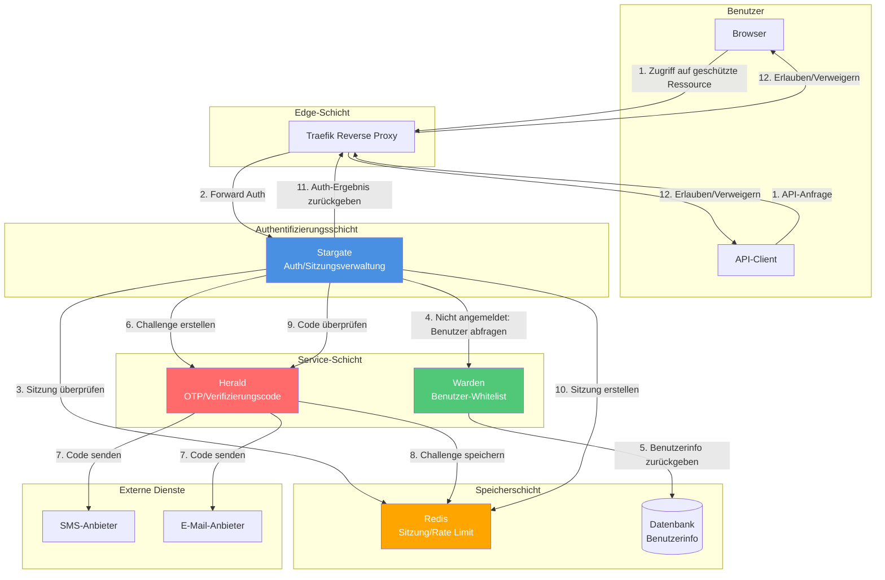

# Stargate Architektur-Dokumentation

Dieses Dokument beschreibt die technische Architektur und Designentscheidungen des Stargate-Projekts.

## Technologie-Stack

- **Sprache**: Go 1.25
- **Web-Framework**: [Fiber v2.52.10](https://github.com/gofiber/fiber)
- **Template-Engine**: [Fiber Template v1.7.5](https://github.com/gofiber/template)
- **Sitzungsverwaltung**: Fiber Session Middleware
- **Protokollierung**: [Logrus v1.9.3](https://github.com/sirupsen/logrus)
- **Terminal-Ausgabe**: [Pterm v0.12.82](https://github.com/pterm/pterm)
- **Test-Framework**: [Testza v0.5.2](https://github.com/MarvinJWendt/testza)

## Projektstruktur

```
src/
├── cmd/stargate/          # Anwendungseinstiegspunkt
│   ├── main.go            # Hauptfunktion, initialisiert Konfiguration und startet Server
│   ├── server.go          # Server-Konfiguration und Routen-Setup
│   └── constants.go       # Routen- und Konfigurationskonstanten
│
├── internal/              # Interne Pakete (nicht extern verfügbar)
│   ├── auth/              # Authentifizierungslogik
│   │   ├── auth.go        # Hauptauthentifizierungsfunktionalität
│   │   └── auth_test.go   # Authentifizierungstests
│   │
│   ├── config/            # Konfigurationsverwaltung
│   │   ├── config.go      # Konfigurationsvariablen-Definitionen und Initialisierung
│   │   ├── validation.go  # Konfigurationsvalidierungslogik
│   │   └── config_test.go # Konfigurationstests
│   │
│   ├── handlers/          # HTTP-Anfragehandler
│   │   ├── check.go       # Authentifizierungsprüfungs-Handler
│   │   ├── login.go       # Login-Handler
│   │   ├── logout.go      # Logout-Handler
│   │   ├── session_share.go # Sitzungsfreigabe-Handler
│   │   ├── health.go       # Gesundheitsprüfungs-Handler
│   │   ├── index.go       # Root-Pfad-Handler
│   │   ├── utils.go       # Handler-Hilfsfunktionen
│   │   └── handlers_test.go # Handler-Tests
│   │
│   ├── i18n/              # Internationalisierungsunterstützung
│   │   └── i18n.go        # Mehrsprachige Übersetzungen
│   │
│   ├── middleware/        # HTTP-Middleware
│   │   └── log.go         # Protokollierungs-Middleware
│   │
│   ├── secure/            # Passwort-Verschlüsselungsalgorithmen
│   │   ├── interface.go   # Verschlüsselungsalgorithmus-Interface
│   │   ├── plaintext.go   # Klartext-Passwort (nur für Tests)
│   │   ├── bcrypt.go      # BCrypt-Algorithmus
│   │   ├── md5.go         # MD5-Algorithmus
│   │   ├── sha512.go      # SHA512-Algorithmus
│   │   └── secure_test.go # Verschlüsselungsalgorithmus-Tests
│   │
│   └── web/               # Web-Ressourcen
│       └── templates/     # HTML-Vorlagen
│           ├── login.html # Login-Seitenvorlage
│           └── assets/   # Statische Ressourcen
│               └── favicon.ico
```

## Hauptkomponenten

### 1. Authentifizierungssystem (`internal/auth`)

Das Authentifizierungssystem ist verantwortlich für:
- Passwort-Überprüfung (unterstützt mehrere Verschlüsselungsalgorithmen)
- Sitzungsverwaltung (erstellen, überprüfen, zerstören)
- Überprüfung des Authentifizierungsstatus

**Wichtige Funktionen:**
- `CheckPassword(password string) bool`: Überprüft das Passwort
- `Authenticate(session *session.Session) error`: Markiert die Sitzung als authentifiziert
- `IsAuthenticated(session *session.Session) bool`: Überprüft, ob die Sitzung authentifiziert ist
- `Unauthenticate(session *session.Session) error`: Zerstört die Sitzung

### 2. Konfigurationssystem (`internal/config`)

Das Konfigurationssystem bietet:
- Verwaltung von Umgebungsvariablen
- Konfigurationsvalidierung
- Unterstützung für Standardwerte

**Konfigurationsvariablen:**
- `AUTH_HOST`: Authentifizierungsdienst-Hostname (erforderlich)
- `PASSWORDS`: Passwort-Konfiguration (Liste Algorithmus:Passwort) (erforderlich)
- `DEBUG`: Debug-Modus (Standard: false)
- `LANGUAGE`: Interface-Sprache (Standard: en, unterstützt en/zh/fr/it/ja/de/ko)
- `COOKIE_DOMAIN`: Cookie-Domain (optional, für Cross-Domain-Sitzungsfreigabe)
- `LOGIN_PAGE_TITLE`: Titel der Login-Seite (Standard: Stargate - Login)
- `LOGIN_PAGE_FOOTER_TEXT`: Fußzeilentext der Login-Seite (Standard: Copyright © 2024 - Stargate)
- `USER_HEADER_NAME`: Name des Benutzer-Headers, der nach erfolgreicher Authentifizierung gesetzt wird (Standard: X-Forwarded-User)
- `PORT`: Abhörport des Dienstes (nur für lokale Entwicklung, Standard: 80)

### 3. Anfragehandler (`internal/handlers`)

Die Handler sind verantwortlich für die Verarbeitung von HTTP-Anfragen:

- **CheckRoute**: Traefik Forward Auth Authentifizierungsprüfung
- **LoginRoute/LoginAPI**: Login-Seite und Login-Verarbeitung
- **LogoutRoute**: Logout-Verarbeitung
- **SessionShareRoute**: Cross-Domain-Sitzungsfreigabe
- **HealthRoute**: Gesundheitsprüfung
- **IndexRoute**: Root-Pfad-Verarbeitung

### 4. Passwort-Verschlüsselung (`internal/secure`)

Unterstützt mehrere Passwort-Verschlüsselungsalgorithmen:
- `plaintext`: Klartext (nur für Tests)
- `bcrypt`: BCrypt-Hash
- `md5`: MD5-Hash
- `sha512`: SHA512-Hash

Alle Algorithmen implementieren das `HashResolver`-Interface:
```go
type HashResolver interface {
    Check(h string, password string) bool
}
```

## Systemarchitektur

### Architekturdiagramm



## Eigenständiger Nutzungsmodus

Stargate ist so konzipiert, dass es vollständig unabhängig ohne externe Abhängigkeiten verwendet werden kann :

- **Passwort-Authentifizierungsmodus** : Verwendet konfigurierte Passwörter zur Authentifizierung, unterstützt mehrere Verschlüsselungsalgorithmen
- **Sitzungsverwaltung** : Cookie-basierte Sitzungsverwaltung, unterstützt Cross-Domain-Sitzungsteilung
- **ForwardAuth** : Bietet eine standardmäßige Traefik Forward Auth-Schnittstelle

Dies ist der primäre Anwendungsfall für Stargate und eignet sich für die meisten Anwendungsszenarien.

## Optionale Service-Integration

Stargate unterstützt optionale Service-Integrationen, um die Authentifizierungsfunktionalität zu erweitern. Diese Integrationen sind alle optional, und Stargate kann vollständig unabhängig verwendet werden.

### Warden-Integration (Optional)

Wenn `WARDEN_ENABLED=true`, kann sich Stargate über Warden SDK mit dem Warden-Service integrieren:

- **Benutzer-Whitelist-Verifizierung**: Überprüfen, ob der Benutzer in der erlaubten Liste ist
- **Benutzerinformationsabruf**: E-Mail, Telefon, user_id und andere Identitätsinformationen des Benutzers abrufen
- **Benutzerstatusprüfung**: Überprüfen, ob das Benutzerkonto aktiv ist

**Integrationsmethode:**
- Warden Go SDK verwenden (`github.com/soulteary/warden/pkg/warden`)
- API-Key-Authentifizierung unterstützen
- Caching unterstützen (konfigurierbares TTL)
- Health-Check-Integration

**Konfigurationsanforderungen:**
- `WARDEN_ENABLED=true`
- `WARDEN_URL` muss gesetzt sein

### Herald-Integration (Optional)

Wenn `HERALD_ENABLED=true`, kann sich Stargate über den Herald-Client mit dem Herald-Service integrieren:

- **Verifizierungscode-Challenge erstellen**: Herald-API aufrufen, um Verifizierungscodes zu erstellen und zu senden
- **Code-Verifizierung**: Herald-API aufrufen, um vom Benutzer eingegebene Codes zu überprüfen
- **Fehlerbehandlung**: Verschiedene von Herald zurückgegebene Fehler behandeln (abgelaufen, gesperrt, rate limited, etc.)

**Integrationsmethode:**
- Herald Go-Client verwenden (`github.com/soulteary/stargate/pkg/herald`)
- API-Key-Authentifizierung unterstützen (Entwicklung)
- HMAC-Signatur-Authentifizierung unterstützen (Produktion, empfohlen)
- mTLS unterstützen (optional)
- Health-Check-Integration

**Konfigurationsanforderungen:**
- `HERALD_ENABLED=true`
- `HERALD_URL` muss gesetzt sein
- Muss entweder `HERALD_API_KEY` oder `HERALD_HMAC_SECRET` setzen

**Sicherheitsanforderungen (Produktionsumgebung):**
- Inter-Service-Kommunikation wird empfohlen, HMAC-Signatur oder mTLS zu verwenden
- Zeitstempel-Verifizierung (verhindert Replay-Angriffe)
- Anfrage-Signatur-Verifizierung

## Arbeitsabläufe

### ForwardAuth-Authentifizierungsablauf (Hauptpfad)

1. **Benutzer greift auf geschützte Ressource zu**
   - Traefik fängt die Anfrage ab
   - Leitet an Stargate-Endpunkt `/_auth` weiter

2. **Stargate überprüft die Authentifizierung**
   - Überprüft zuerst den Header `Stargate-Password` (API-Authentifizierung)
   - Wenn Header-Authentifizierung fehlschlägt, überprüft das Cookie `stargate_session_id` (Web-Authentifizierung)
   - **Überprüft nur die Sitzung, ruft keine externen Services auf** (stellt hohe Leistung sicher)

3. **Authentifizierung erfolgreich**
   - Setzt den Header `X-Forwarded-User` (oder den konfigurierten Benutzer-Header-Namen) mit Benutzerinformationen
   - Gibt 200 OK zurück
   - Traefik erlaubt der Anfrage fortzufahren

4. **Authentifizierung fehlgeschlagen**
   - HTML-Anfragen: Weiterleitung zur Login-Seite (`/_login?callback=<originalURL>`)
   - API-Anfragen (JSON/XML): Gibt 401 Unauthorized zurück

### Passwort-Authentifizierungs-Login-Ablauf

1. **Benutzer greift auf Login-Seite zu**
   - `GET /_login?callback=<url>`
   - Wenn bereits angemeldet, Weiterleitung zum Sitzungsaustausch-Endpunkt
   - Wenn die Domain unterschiedlich ist, speichert den Callback im Cookie (`stargate_callback`)

2. **Login-Formular absenden**
   - `POST /_login` mit Passwort und `auth_method=password`
   - Überprüft das Passwort (verwendet konfigurierten Passwort-Algorithmus)
   - Erstellt eine Sitzung und setzt das Cookie
   - **Callback-Abrufpriorität**:
     1. Vom Cookie (wenn zuvor gesetzt)
     2. Von den Formulardaten
     3. Von den Abfrageparametern
     4. Wenn keines der oben genannten vorhanden ist und die ursprüngliche Domain sich von der Authentifizierungsdienst-Domain unterscheidet, die ursprüngliche Domain als Callback verwenden

3. **Sitzungsaustausch**
   - Wenn Callback vorhanden ist, Weiterleitung zu `{callback}/_session_exchange?id=<session_id>`
   - `GET /_session_exchange?id=<session_id>`
   - Setzt das Sitzungs-Cookie (wenn `COOKIE_DOMAIN` konfiguriert ist, setzt auf die angegebene Domain)
   - Weiterleitung zum Root-Pfad `/`

### Warden + Herald OTP-Authentifizierungs-Login-Ablauf (Optional)

Wenn Warden- und Herald-Integrationen aktiviert sind, kann OTP-Authentifizierung verwendet werden :

1. **Benutzer greift auf Login-Seite zu**
   - `GET /_login?callback=<url>`
   - Zeigt Login-Formular an (unterstützt E-Mail/Telefonnummer-Eingabe)

2. **Benutzer gibt Identifikator ein und fordert Verifizierungscode an**
   - Benutzer gibt E-Mail oder Telefonnummer ein
   - `POST /_send_verify_code` sendet Verifizierungscode-Anfrage
   - Wenn Warden aktiviert ist : Stargate → Warden fragt Benutzer ab (Whitelist-Verifizierung, Statusprüfung), erhält user_id + email/phone
   - Wenn Herald aktiviert ist : Stargate → Herald erstellt Challenge und sendet Verifizierungscode (SMS oder E-Mail)
   - Herald gibt challenge_id, expires_in, next_resend_in zurück

3. **Benutzer sendet Verifizierungscode**
   - `POST /_login` mit Verifizierungscode und `auth_method=warden`
   - Wenn Herald aktiviert ist : Stargate → Herald verify(challenge_id, code)
   - Herald gibt ok + user_id (+ optionales amr/Authentifizierungsstärke) zurück

4. **Sitzung erstellen**
   - Stargate gibt Sitzung aus (Cookie/JWT)
   - Wenn Warden aktiviert ist : Ruft Benutzerinformationen von Warden ab und schreibt in Sitzungs-Claims
   - Setzt Sitzungs-Cookie

5. **Sitzungsaustausch**
   - Wenn Callback vorhanden ist, Weiterleitung zu `{callback}/_session_exchange?id=<session_id>`
   - Nachfolgender forwardAuth überprüft nur Stargate-Sitzung, stellt hohe Leistung sicher

## Sicherheitsüberlegungen

### Sitzungssicherheit

- Cookies verwenden das Flag `HttpOnly`, um XSS-Angriffe zu verhindern
- Cookies verwenden `SameSite=Lax`, um CSRF-Angriffe zu verhindern
- Der Cookie-Pfad ist auf `/` gesetzt, ermöglicht die Verwendung auf der gesamten Domain
- Sitzungsablaufzeit: 24 Stunden (`config.SessionExpiration`)
- Unterstützt benutzerdefinierte Cookie-Domain (für Cross-Domain-Szenarien)
- Sitzungs-IDs werden mit UUID generiert, um Einzigartigkeit und Sicherheit zu gewährleisten

### Passwortsicherheit

- Unterstützt mehrere Verschlüsselungsalgorithmen (empfohlen: bcrypt oder sha512 verwenden)
- Passwort-Konfiguration wird über Umgebungsvariablen übergeben, nicht im Code gespeichert
- Passwort-Normalisierung bei der Überprüfung (Leerzeichen entfernen, in Großbuchstaben umwandeln)

### Anfragesicherheit

- Der Authentifizierungsprüfungs-Endpunkt unterstützt zwei Authentifizierungsmethoden:
  - Header-Authentifizierung (`Stargate-Password`): Für API-Anfragen
  - Cookie-Authentifizierung: Für Web-Anfragen
- Unterscheidet zwischen HTML- und API-Anfragen, gibt entsprechende Antworten zurück

## Erweiterbarkeit

### Hinzufügen neuer Passwort-Algorithmen

1. Neue Algorithmus-Implementierung in `internal/secure/` erstellen
2. `HashResolver`-Interface implementieren
3. Algorithmus in `config/validation.go` registrieren

### Hinzufügen neuer Sprachen

1. Sprachkonstante in `internal/i18n/i18n.go` hinzufügen
2. Übersetzungszuordnungen hinzufügen
3. Sprachoption in der Konfiguration hinzufügen

### Anpassen der Login-Seite

Template-Datei `internal/web/templates/login.html` ändern.

## Leistungsoptimierung

- Verwendet Fiber-Framework, basierend auf fasthttp, hervorragende Leistung
- Sitzungen im Speicher gespeichert für schnellen Zugriff
- Statische Ressourcen werden über den statischen Dateiserver von Fiber bereitgestellt
- Unterstützt Debug-Modus, kann in der Produktion deaktiviert werden

## Bereitstellungsarchitektur

### Docker-Bereitstellung

- Multi-Stage-Build zur Reduzierung der Image-Größe
- Verwendet `golang:1.25-alpine` als Build-Stufe
- Verwendet `scratch`-Basis-Image als Ausführungsstufe, um Sicherheitsrisiken zu minimieren
- Template-Dateien von `src/internal/web/templates` nach `/app/web/templates` im Image kopiert
- Verwendet chinesische Mirror-Quelle (`GOPROXY=https://goproxy.cn`), um Abhängigkeits-Downloads zu beschleunigen
- Verwendet `-ldflags "-s -w"` beim Kompilieren, um die Binärgröße zu reduzieren
- Die Anwendung findet automatisch Template-Pfade (unterstützt `./internal/web/templates` für lokale Entwicklung und `./web/templates` für Produktion)

### Traefik-Integration

- Integriert über Forward Auth Middleware
- Unterstützt HTTP und HTTPS
- Unterstützt mehrere Domains und Pfadregeln

## Protokollierung und Überwachung

- Verwendet Logrus für die Protokollierung
- Unterstützt Debug-Modus (DEBUG=true)
- Alle kritischen Operationen werden protokolliert
- Gesundheitsprüfungs-Endpunkt für die Überwachung verfügbar

## Tests

- Unit-Tests decken die Hauptfunktionalität ab
- Testdateien befinden sich in den `*_test.go`-Dateien jedes Pakets
- Verwendet `testza` für Assertions
- Testabdeckung umfasst:
  - Authentifizierungslogik (`internal/auth/auth_test.go`)
  - Konfigurationsvalidierung (`internal/config/config_test.go`)
  - Passwort-Verschlüsselungsalgorithmen (`internal/secure/secure_test.go`)
  - HTTP-Handler (`internal/handlers/handlers_test.go`)

## Datenfluss und Sicherheitsgrenzen

### Datenfluss

**Datenfluss beim Login:**
1. Benutzer gibt Identifikator (E-Mail/Telefon) ein → Stargate
2. Stargate → Warden: Benutzerinformationen abfragen (geschützt durch HMAC/mTLS)
3. Warden → Stargate: Gibt user_id, E-Mail, Telefon, Status zurück
4. Stargate → Herald: Challenge erstellen (geschützt durch HMAC/mTLS)
5. Herald → Provider: Verifizierungscode senden (SMS/E-Mail)
6. Benutzer gibt Verifizierungscode ein → Stargate
7. Stargate → Herald: Code überprüfen (geschützt durch HMAC/mTLS)
8. Herald → Stargate: Gibt Verifizierungsergebnis zurück
9. Stargate: Sitzung erstellen → Redis

**Datenfluss ForwardAuth (Hauptpfad):**
1. Traefik → Stargate: Authentifizierungsprüfungsanfrage
2. Stargate: Liest Sitzung aus Redis (oder analysiert aus Cookie)
3. Stargate → Traefik: Gibt Authentifizierungsergebnis zurück (2xx oder 401/302)

### Sicherheitsgrenzen

- **Inter-Service-Kommunikation**: Geschützt durch HMAC-Signatur oder mTLS
- **PII-Schutz**: Sensible Informationen (E-Mail/Telefon) werden in Protokollen maskiert
- **Code-Sicherheit**: Herald speichert nur Code-Hash, nicht Klartext
- **Sitzungssicherheit**: Sitzungs-ID verwendet UUID, Cookie verwendet HttpOnly und SameSite
- **Zeitstempel-Verifizierung**: HMAC-Signatur enthält Zeitstempel, um Replay-Angriffe zu verhindern

## Zukünftige Verbesserungen

- [x] Unterstützung für Warden-Benutzer-Whitelist-Authentifizierung
- [x] Unterstützung für Herald-OTP/Verifizierungscode-Service-Integration
- [x] Unterstützung für externe Redis-Sitzungsspeicherung
- [x] Prometheus-Metriken-Export hinzufügen
- [ ] Unterstützung für mehr Passwort-Verschlüsselungsalgorithmen
- [ ] Unterstützung für OAuth2/OpenID Connect
- [ ] Unterstützung für Multi-Benutzer- und Rollenverwaltung
- [ ] Administrationsoberfläche hinzufügen
- [ ] Unterstützung für Konfigurationsdateien (YAML/JSON)
