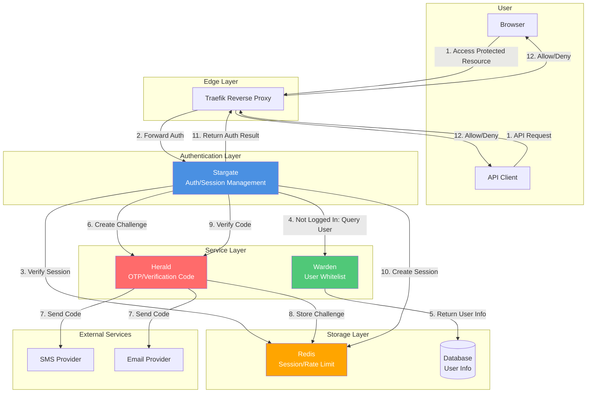

# Stargate Architecture Document

This document describes the technical architecture and design decisions of the Stargate project.

## Technology Stack

- **Language**: Go 1.25
- **Web Framework**: [Fiber v2.52.10](https://github.com/gofiber/fiber)
- **Template Engine**: [Fiber Template v1.7.5](https://github.com/gofiber/template)
- **Session Management**: Fiber Session Middleware
- **Logging**: [Logrus v1.9.3](https://github.com/sirupsen/logrus)
- **Terminal Output**: [Pterm v0.12.82](https://github.com/pterm/pterm)
- **Testing Framework**: [Testza v0.5.2](https://github.com/MarvinJWendt/testza)

## Project Structure

```
src/
├── cmd/stargate/          # Application entry point
│   ├── main.go            # Main function, initializes configuration and starts server
│   ├── server.go          # Server configuration and route setup
│   └── constants.go       # Route and configuration constants
│
├── internal/              # Internal packages (not exposed externally)
│   ├── auth/              # Authentication logic
│   │   ├── auth.go        # Authentication core functionality
│   │   └── auth_test.go   # Authentication tests
│   │
│   ├── config/            # Configuration management
│   │   ├── config.go      # Configuration variable definitions and initialization
│   │   ├── validation.go  # Configuration validation logic
│   │   └── config_test.go # Configuration tests
│   │
│   ├── handlers/          # HTTP request handlers
│   │   ├── check.go       # Authentication check handler
│   │   ├── login.go       # Login handler
│   │   ├── logout.go      # Logout handler
│   │   ├── session_share.go # Session sharing handler
│   │   ├── health.go      # Health check handler
│   │   ├── index.go       # Root path handler
│   │   ├── utils.go       # Handler utility functions
│   │   └── handlers_test.go # Handler tests
│   │
│   ├── i18n/              # Internationalization support
│   │   └── i18n.go        # Multi-language translations
│   │
│   ├── middleware/        # HTTP middleware
│   │   └── log.go         # Logging middleware
│   │
│   ├── secure/            # Password encryption algorithms
│   │   ├── interface.go   # Encryption algorithm interface
│   │   ├── plaintext.go   # Plain text password (testing only)
│   │   ├── bcrypt.go      # BCrypt algorithm
│   │   ├── md5.go         # MD5 algorithm
│   │   ├── sha512.go      # SHA512 algorithm
│   │   └── secure_test.go # Encryption algorithm tests
│   │
│   └── web/               # Web resources
│       └── templates/     # HTML templates
│           ├── login.html # Login page template
│           └── assets/   # Static resources
│               └── favicon.ico
```

## Core Components

### 1. Authentication System (`internal/auth`)

The authentication system is responsible for:
- Password verification (supports multiple encryption algorithms)
- Session management (create, verify, destroy)
- Authentication status checking

**Key Functions:**
- `CheckPassword(password string) bool`: Verifies password
- `Authenticate(session *session.Session) error`: Marks session as authenticated
- `IsAuthenticated(session *session.Session) bool`: Checks if session is authenticated
- `Unauthenticate(session *session.Session) error`: Destroys session

### 2. Configuration System (`internal/config`)

The configuration system provides:
- Environment variable management
- Configuration validation
- Default value support

**Configuration Variables:**

**Basic Configuration:**
- `AUTH_HOST`: Authentication hostname (required)
- `PASSWORDS`: Password configuration (algorithm:password list) (required, for password authentication mode)
- `DEBUG`: Debug mode (default: false)
- `LANGUAGE`: Interface language (default: en, supports en/zh)
- `COOKIE_DOMAIN`: Cookie domain (optional, for cross-domain session sharing)
- `LOGIN_PAGE_TITLE`: Login page title (default: Stargate - Login)
- `LOGIN_PAGE_FOOTER_TEXT`: Login page footer text (default: Copyright © 2024 - Stargate)
- `USER_HEADER_NAME`: User header name set after successful authentication (default: X-Forwarded-User)
- `PORT`: Service listening port (local development only, default: 80)

**Warden Integration Configuration:**
- `WARDEN_ENABLED`: Enable Warden integration (default: false)
- `WARDEN_URL`: Warden service base URL
- `WARDEN_API_KEY`: Warden API Key (for service authentication)
- `WARDEN_CACHE_TTL`: Warden cache TTL (seconds, default: 300)

**Herald Integration Configuration:**
- `HERALD_ENABLED`: Enable Herald integration (default: false)
- `HERALD_URL`: Herald service base URL
- `HERALD_API_KEY`: Herald API Key (development environment)
- `HERALD_HMAC_SECRET`: Herald HMAC secret (production environment, recommended)
- `HERALD_TLS_CA_CERT_FILE`: Herald TLS CA certificate file (mTLS)
- `HERALD_TLS_CLIENT_CERT_FILE`: Herald TLS client certificate file (mTLS)
- `HERALD_TLS_CLIENT_KEY_FILE`: Herald TLS client key file (mTLS)
- `HERALD_TLS_SERVER_NAME`: Herald TLS server name (SNI)

### 3. Request Handlers (`internal/handlers`)

Handlers are responsible for processing HTTP requests:

- **CheckRoute**: Traefik Forward Auth authentication check (only verifies session)
- **LoginRoute/LoginAPI**: Login page and login processing (supports password and Warden+Herald OTP)
- **SendVerifyCodeAPI**: Send verification code (calls Herald to create challenge)
- **LogoutRoute**: Logout processing
- **SessionShareRoute**: Cross-domain session sharing
- **HealthRoute**: Health check (includes Warden and Herald health status)
- **IndexRoute**: Root path processing

### 4. Password Encryption (`internal/secure`)

Supports multiple password encryption algorithms:
- `plaintext`: Plain text (testing only)
- `bcrypt`: BCrypt hash
- `md5`: MD5 hash
- `sha512`: SHA512 hash

All algorithms implement the `HashResolver` interface:
```go
type HashResolver interface {
    Check(h string, password string) bool
}
```

## System Architecture

### Architecture Diagram



### Standalone Usage Mode

Stargate is designed to be used completely independently without any external dependencies:

- **Password Authentication Mode**: Uses configured passwords for authentication, supports multiple encryption algorithms
- **Session Management**: Cookie-based session management, supports cross-domain session sharing
- **ForwardAuth**: Provides standard Traefik Forward Auth interface

This is the primary use case for Stargate, suitable for most application scenarios.

### Optional Service Integration

Stargate can optionally integrate with Warden and Herald services to provide advanced authentication features:

#### Warden Integration (Optional)

When Warden integration is enabled:
- Provides user whitelist management functionality
- Supports authentication based on user lists
- Provides user information queries (email/phone/user_id/status)

#### Herald Integration (Optional)

When Herald integration is enabled:
- Provides OTP/verification code sending and verification functionality
- Supports SMS and email verification codes
- Provides complete verification code lifecycle management

**Note**: Warden and Herald integrations are optional. Stargate can be used independently, or you can optionally enable these integration features.

## Optional Service Integration

Stargate supports optional service integrations to extend authentication functionality. These integrations are all optional, and Stargate can be used completely independently.

### Warden Integration (Optional)

When `WARDEN_ENABLED=true`, Stargate can integrate with Warden service through Warden SDK:

- **User Whitelist Verification**: Check if user is in the allowed list
- **User Information Retrieval**: Get user's email, phone, user_id, and other identity information
- **User Status Check**: Verify if user account is active

**Integration Method:**
- Use Warden Go SDK (`github.com/soulteary/warden/pkg/warden`)
- Support API Key authentication
- Support caching (configurable TTL)
- Health check integration

**Configuration Requirements:**
- `WARDEN_ENABLED=true`
- `WARDEN_URL` must be set

### Herald Integration (Optional)

When `HERALD_ENABLED=true`, Stargate can integrate with Herald service through Herald client:

- **Create Verification Code Challenge**: Call Herald API to create and send verification codes
- **Code Verification**: Call Herald API to verify user-input codes
- **Error Handling**: Handle various errors returned by Herald (expired, locked, rate limited, etc.)

**Integration Method:**
- Use Herald Go client (`github.com/soulteary/stargate/pkg/herald`)
- Support API Key authentication (development)
- Support HMAC signature authentication (production, recommended)
- Support mTLS (optional)
- Health check integration

**Configuration Requirements:**
- `HERALD_ENABLED=true`
- `HERALD_URL` must be set
- Must set either `HERALD_API_KEY` or `HERALD_HMAC_SECRET`

**Security Requirements (Production Environment):**
- Inter-service communication recommended to use HMAC signature or mTLS
- Timestamp verification (prevent replay attacks)
- Request signature verification

## Workflow

### ForwardAuth Authentication Flow (Main Path)

1. **User accesses protected resource**
   - Traefik intercepts the request
   - Forwards to Stargate `/_auth` endpoint

2. **Stargate checks authentication**
   - First checks `Stargate-Password` header (API authentication)
   - If header authentication fails, checks `stargate_session_id` cookie (Web authentication)
   - **Only verifies Session, does not call external services** (ensures high performance)

3. **Authentication succeeds**
   - Sets `X-Forwarded-User` header (or configured user header name) with user information
   - Returns 200 OK
   - Traefik allows the request to continue

4. **Authentication fails**
   - HTML requests: Redirects to login page (`/_login?callback=<originalURL>`)
   - API requests (JSON/XML): Returns 401 Unauthorized

### Password Authentication Login Flow

1. **User accesses login page**
   - `GET /_login?callback=<url>`
   - If already logged in, redirects to session exchange endpoint
   - If domain differs, stores callback in cookie (`stargate_callback`)

2. **Submit login form**
   - `POST /_login` with password and `auth_method=password`
   - Verifies password (using configured password algorithm)
   - Creates session and sets cookie
   - **Callback retrieval priority**:
     1. From cookie (if previously set)
     2. From form data
     3. From query parameters
     4. If none of the above, and origin domain differs from authentication service domain, use origin domain as callback

3. **Session exchange**
   - If callback exists, redirects to `{callback}/_session_exchange?id=<session_id>`
   - `GET /_session_exchange?id=<session_id>`
   - Sets session cookie (if `COOKIE_DOMAIN` is configured, sets to specified domain)
   - Redirects to root path `/`

### Warden + Herald OTP Authentication Login Flow (Optional)

When Warden and Herald integrations are enabled, OTP authentication can be used:

1. **User accesses login page**
   - `GET /_login?callback=<url>`
   - Displays login form (supports email/phone input)

2. **User enters identifier and requests verification code**
   - User enters email or phone number
   - `POST /_send_verify_code` sends verification code request
   - If Warden is enabled: Stargate → Warden queries user (whitelist verification, status check), gets user_id + email/phone
   - If Herald is enabled: Stargate → Herald creates challenge and sends verification code (SMS or Email)
   - Herald returns challenge_id, expires_in, next_resend_in

3. **User submits verification code**
   - `POST /_login` with verification code and `auth_method=warden`
   - If Herald is enabled: Stargate → Herald verify(challenge_id, code)
   - Herald returns ok + user_id (+ optional amr/authentication strength)

4. **Create session**
   - Stargate issues session (cookie/JWT)
   - If Warden is enabled: Get user information from Warden and write to session claims
   - Set session cookie

5. **Session exchange**
   - If callback exists, redirects to `{callback}/_session_exchange?id=<session_id>`
   - Subsequent forwardAuth only verifies Stargate session, ensuring high performance (unless authorization info refresh is needed)

## Security Considerations

### Session Security

- Cookies use `HttpOnly` flag to prevent XSS attacks
- Cookies use `SameSite=Lax` to prevent CSRF attacks
- Cookie path is set to `/`, allowing use across the entire domain
- Session expiration time: 24 hours (`config.SessionExpiration`)
- Supports custom cookie domain (for cross-domain scenarios)
- Session IDs are generated using UUID to ensure uniqueness and security

### Password Security

- Supports multiple encryption algorithms (recommend using bcrypt or sha512)
- Password configuration passed via environment variables, not stored in code
- Password normalization during verification (remove spaces, convert to uppercase)

### Request Security

- Authentication check endpoint supports two authentication methods:
  - Header authentication (`Stargate-Password`): For API requests
  - Cookie authentication: For Web requests
- Distinguishes between HTML and API requests, returns appropriate responses

## Extensibility

### Adding New Password Algorithms

1. Create new algorithm implementation in `internal/secure/`
2. Implement `HashResolver` interface
3. Register algorithm in `config/validation.go`

### Adding New Languages

1. Add language constant in `internal/i18n/i18n.go`
2. Add translation mappings
3. Add language option in configuration

### Customizing Login Page

Modify the `internal/web/templates/login.html` template file.

## Performance Optimization

- Uses Fiber framework, based on fasthttp, excellent performance
- Sessions stored in memory for fast access
- Static resources served via Fiber static file service
- Supports debug mode, can be disabled in production

## Deployment Architecture

### Docker Deployment

- Multi-stage build to reduce image size
- Uses `golang:1.25-alpine` as build stage
- Uses `scratch` base image as runtime stage to minimize security risks
- Template files copied from `src/internal/web/templates` to `/app/web/templates` in image
- Uses Chinese mirror source (`GOPROXY=https://goproxy.cn`) to accelerate dependency downloads
- Uses `-ldflags "-s -w"` during compilation to reduce binary size
- Application automatically finds template paths (supports `./internal/web/templates` for local development and `./web/templates` for production)

### Traefik Integration

- Integrated via Forward Auth middleware
- Supports HTTP and HTTPS
- Supports multiple domains and path rules

## Logging and Monitoring

- Uses Logrus for logging
- Supports debug mode (DEBUG=true)
- All critical operations are logged
- Health check endpoint available for monitoring

## Testing

- Unit tests cover core functionality
- Test files located in `*_test.go` files in each package
- Uses `testza` for assertions
- Test coverage includes:
  - Authentication logic (`internal/auth/auth_test.go`)
  - Configuration validation (`internal/config/config_test.go`)
  - Password encryption algorithms (`internal/secure/secure_test.go`)
  - HTTP handlers (`internal/handlers/handlers_test.go`)

## Data Flow and Security Boundaries

### Data Flow

**Login Flow Data Flow:**
1. User enters identifier (email/phone) → Stargate
2. Stargate → Warden: Query user information (protected by HMAC/mTLS)
3. Warden → Stargate: Return user_id, email, phone, status
4. Stargate → Herald: Create challenge (protected by HMAC/mTLS)
5. Herald → Provider: Send verification code (SMS/Email)
6. User enters verification code → Stargate
7. Stargate → Herald: Verify code (protected by HMAC/mTLS)
8. Herald → Stargate: Return verification result
9. Stargate: Create session → Redis

**ForwardAuth Data Flow (Main Path):**
1. Traefik → Stargate: Authentication check request
2. Stargate: Read session from Redis (or parse from Cookie)
3. Stargate → Traefik: Return authentication result (2xx or 401/302)

### Security Boundaries

- **Inter-Service Communication**: Protected by HMAC signature or mTLS
- **PII Protection**: Sensitive information (email/phone) is masked in logs
- **Code Security**: Herald only stores code hash, not plaintext
- **Session Security**: Session ID uses UUID, Cookie uses HttpOnly and SameSite
- **Timestamp Verification**: HMAC signature includes timestamp to prevent replay attacks

## Future Improvements

- [x] Support Warden user whitelist authentication
- [x] Support Herald OTP/verification code service integration
- [x] Support Redis external session storage
- [x] Add Prometheus metrics export
- [ ] Support more password encryption algorithms
- [ ] Support OAuth2/OpenID Connect
- [ ] Support multi-user and role management
- [ ] Add admin interface
- [ ] Support configuration files (YAML/JSON)
