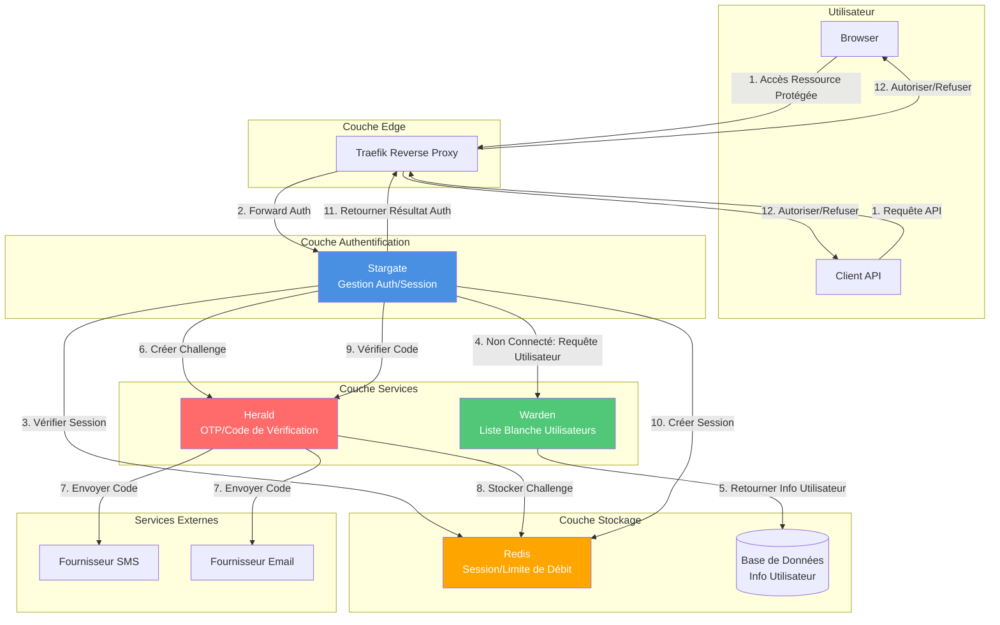

# Document d'Architecture Stargate

Ce document décrit l'architecture technique et les décisions de conception du projet Stargate.

## Pile Technologique

- **Langage** : Go 1.26
- **Framework Web** : [Fiber v2.52.10](https://github.com/gofiber/fiber)
- **Moteur de Template** : [Fiber Template v1.7.5](https://github.com/gofiber/template)
- **Gestion de Session** : Middleware de Session Fiber
- **Journalisation** : [Logrus v1.9.3](https://github.com/sirupsen/logrus)
- **Sortie Terminal** : [Pterm v0.12.82](https://github.com/pterm/pterm)
- **Framework de Test** : [Testza v0.5.2](https://github.com/MarvinJWendt/testza)

## Structure du Projet

```
src/
├── cmd/stargate/          # Point d'entrée de l'application
│   ├── main.go            # Fonction principale, initialise la configuration et démarre le serveur
│   ├── server.go          # Configuration du serveur et configuration des routes
│   └── constants.go       # Constantes de route et de configuration
│
├── internal/              # Packages internes (non exposés en externe)
│   ├── auditlog/          # Journalisation d'audit
│   ├── auth/              # Logique d'authentification (vérification mot de passe, session, client Warden)
│   ├── config/            # Gestion de la configuration (variables d'env, validation, step-up)
│   ├── handlers/          # Gestionnaires de requêtes HTTP (forwardAuth, login, logout, code de vérification, TOTP, etc.)
│   ├── heraldtotp/        # Client Herald TOTP
│   ├── i18n/              # Support d'internationalisation
│   ├── metrics/           # Métriques Prometheus
│   ├── tracing/           # Middleware de traçage OpenTelemetry
│   └── web/               # Ressources Web et templates HTML
```

La logique de mot de passe et de sécurité est fournie par `config` (configuration d'algorithme), `auth` (vérification et session) et des packages externes (ex. secure-kit, session-kit). Il n'y a pas de répertoires `internal/secure` ou `internal/middleware`.

## Composants Principaux

### 1. Système d'Authentification (`internal/auth`)

Le système d'authentification est responsable de :
- Vérification du mot de passe (supporte plusieurs algorithmes de chiffrement)
- Gestion de session (créer, vérifier, détruire)
- Vérification du statut d'authentification

**Fonctions Clés :**
- `CheckPassword(password string) bool` : Vérifie le mot de passe
- `Authenticate(session *session.Session) error` : Marque la session comme authentifiée
- `IsAuthenticated(session *session.Session) bool` : Vérifie si la session est authentifiée
- `Unauthenticate(session *session.Session) error` : Détruit la session

### 2. Système de Configuration (`internal/config`)

Le système de configuration fournit :
- Gestion des variables d'environnement
- Validation de la configuration
- Support des valeurs par défaut

**Variables de Configuration :**
- `AUTH_HOST` : Nom d'hôte d'authentification (requis)
- `PASSWORDS` : Configuration du mot de passe (liste algorithme:mot de passe) (requis)
- `DEBUG` : Mode débogage (par défaut : false)
- `LANGUAGE` : Langue de l'interface (par défaut : en, supporte en/zh/fr/it/ja/de/ko)
- `COOKIE_DOMAIN` : Domaine du cookie (optionnel, pour le partage de session cross-domain)
- `LOGIN_PAGE_TITLE` : Titre de la page de connexion (par défaut : Stargate - Login)
- `LOGIN_PAGE_FOOTER_TEXT` : Texte du pied de page de connexion (par défaut : Copyright © 2024 - Stargate)
- `USER_HEADER_NAME` : Nom de l'en-tête utilisateur défini après authentification réussie (par défaut : X-Forwarded-User)
- `PORT` : Port d'écoute du service (développement local uniquement, par défaut : 80)

### 3. Gestionnaires de Requêtes (`internal/handlers`)

Les gestionnaires sont responsables du traitement des requêtes HTTP :

- **CheckRoute** : Vérification d'authentification Traefik Forward Auth
- **LoginRoute/LoginAPI** : Page de connexion et traitement de connexion
- **LogoutRoute** : Traitement de déconnexion
- **SessionShareRoute** : Partage de session cross-domain
- **HealthRoute** : Vérification de santé
- **IndexRoute** : Traitement du chemin racine

### 4. Mot de passe et sécurité

La vérification du mot de passe est assurée par `internal/auth` avec `internal/config` : la configuration spécifie l'algorithme (ex. plaintext, bcrypt, md5, sha512) et la liste des mots de passe ; auth utilise des capacités externes comme secure-kit pour la vérification. La session et l'état d'authentification sont fournis par session-kit.

## Architecture Système

### Diagramme d'Architecture



## Mode d'Utilisation Autonome

Stargate est conçu pour être utilisé complètement de manière indépendante, sans dépendances externes :

- **Mode d'Authentification par Mot de Passe** : Utilise des mots de passe configurés pour l'authentification, supporte plusieurs algorithmes de chiffrement
- **Gestion de Session** : Gestion de session basée sur Cookie, supporte le partage de session cross-domain
- **ForwardAuth** : Fournit une interface Traefik Forward Auth standard

C'est le cas d'utilisation principal de Stargate, adapté à la plupart des scénarios d'application.

## Intégration de Services Optionnels

Stargate supporte les intégrations de services optionnels pour étendre la fonctionnalité d'authentification. Ces intégrations sont toutes optionnelles, et Stargate peut être utilisé complètement de manière indépendante.

### Intégration Warden (Optionnelle)

Lorsque `WARDEN_ENABLED=true`, Stargate peut s'intégrer avec le service Warden via Warden SDK :

- **Vérification de Liste Blanche Utilisateurs** : Vérifier si l'utilisateur est dans la liste autorisée
- **Récupération d'Informations Utilisateur** : Obtenir l'email, le téléphone, user_id et autres informations d'identité de l'utilisateur
- **Vérification du Statut Utilisateur** : Vérifier si le compte utilisateur est actif

**Méthode d'Intégration :**
- Utiliser Warden Go SDK (`github.com/soulteary/warden/pkg/warden`)
- Support de l'authentification par clé API
- Support du cache (TTL configurable)
- Intégration de vérification de santé

**Exigences de Configuration :**
- `WARDEN_ENABLED=true`
- `WARDEN_URL` doit être défini

### Intégration Herald (Optionnelle)

Lorsque `HERALD_ENABLED=true`, Stargate peut s'intégrer avec le service Herald via le client Herald :

- **Création de Challenge de Code de Vérification** : Appeler l'API Herald pour créer et envoyer des codes de vérification
- **Vérification de Code** : Appeler l'API Herald pour vérifier les codes saisis par l'utilisateur
- **Gestion des Erreurs** : Gérer diverses erreurs renvoyées par Herald (expiré, verrouillé, limité, etc.)

**Méthode d'Intégration :**
- Utiliser le client Herald Go (`github.com/soulteary/stargate/pkg/herald`)
- Support de l'authentification par clé API (développement)
- Support de l'authentification par signature HMAC (production, recommandé)
- Support mTLS (optionnel)
- Intégration de vérification de santé

**Exigences de Configuration :**
- `HERALD_ENABLED=true`
- `HERALD_URL` doit être défini
- Doit définir soit `HERALD_API_KEY` soit `HERALD_HMAC_SECRET`

**Exigences de Sécurité (Environnement de Production) :**
- Communication inter-services recommandée pour utiliser la signature HMAC ou mTLS
- Vérification de l'horodatage (prévenir les attaques de rejeu)
- Vérification de la signature de requête

## Flux de Travail

### Flux d'Authentification ForwardAuth (Chemin Principal)

1. **L'utilisateur accède à une ressource protégée**
   - Traefik intercepte la requête
   - Transmet à l'endpoint Stargate `/_auth`

2. **Stargate vérifie l'authentification**
   - Vérifie d'abord l'en-tête `Stargate-Password` (authentification API)
   - Si l'authentification par en-tête échoue, vérifie le cookie `stargate_session_id` (authentification Web)
   - **Vérifie uniquement la Session, n'appelle pas les services externes** (garantit des performances élevées)

3. **Authentification réussie**
   - Définit l'en-tête `X-Forwarded-User` (ou le nom d'en-tête utilisateur configuré) avec les informations utilisateur
   - Retourne 200 OK
   - Traefik permet à la requête de continuer

4. **Authentification échouée**
   - Requêtes HTML : Redirige vers la page de connexion (`/_login?callback=<originalURL>`)
   - Requêtes API (JSON/XML) : Retourne 401 Unauthorized

### Flux de Connexion par Mot de Passe

1. **L'utilisateur accède à la page de connexion**
   - `GET /_login?callback=<url>`
   - Si déjà connecté, redirige vers l'endpoint d'échange de session
   - Si le domaine diffère, stocke le callback dans le cookie (`stargate_callback`)

2. **Soumission du formulaire de connexion**
   - `POST /_login` avec mot de passe et `auth_method=password`
   - Vérifie le mot de passe (utilise l'algorithme de mot de passe configuré)
   - Crée une session et définit le cookie
   - **Priorité de récupération du callback** :
     1. Depuis le cookie (si précédemment défini)
     2. Depuis les données du formulaire
     3. Depuis les paramètres de requête
     4. Si aucun des éléments ci-dessus, et le domaine d'origine diffère du domaine du service d'authentification, utiliser le domaine d'origine comme callback

3. **Échange de session**
   - Si le callback existe, redirige vers `{callback}/_session_exchange?id=<session_id>`
   - `GET /_session_exchange?id=<session_id>`
   - Définit le cookie de session (si `COOKIE_DOMAIN` est configuré, définit au domaine spécifié)
   - Redirige vers le chemin racine `/`

### Flux d'Authentification OTP Warden + Herald (Optionnel)

Lorsque les intégrations Warden et Herald sont activées, l'authentification OTP peut être utilisée :

1. **L'utilisateur accède à la page de connexion**
   - `GET /_login?callback=<url>`
   - Affiche le formulaire de connexion (supporte la saisie email/téléphone)

2. **L'utilisateur entre un identifiant et demande un code de vérification**
   - L'utilisateur entre un email ou un numéro de téléphone
   - `POST /_send_verify_code` envoie une demande de code de vérification
   - Si Warden est activé : Stargate → Warden interroge l'utilisateur (vérification de liste blanche, vérification de statut), obtient user_id + email/phone
   - Si Herald est activé : Stargate → Herald crée un challenge et envoie un code de vérification (SMS ou Email)
   - Herald retourne challenge_id, expires_in, next_resend_in

3. **L'utilisateur soumet le code de vérification**
   - `POST /_login` avec code de vérification et `auth_method=warden`
   - Si Herald est activé : Stargate → Herald verify(challenge_id, code)
   - Herald retourne ok + user_id (+ amr/force d'authentification optionnel)

4. **Création de session**
   - Stargate émet une session (cookie/JWT)
   - Si Warden est activé : Obtient les informations utilisateur de Warden et écrit dans les claims de session
   - Définit le cookie de session

5. **Échange de session**
   - Si le callback existe, redirige vers `{callback}/_session_exchange?id=<session_id>`
   - Le forwardAuth suivant vérifie uniquement la session Stargate, garantissant des performances élevées

## Considérations de Sécurité

### Sécurité de Session

- Les cookies utilisent le flag `HttpOnly` pour prévenir les attaques XSS
- Les cookies utilisent `SameSite=Lax` pour prévenir les attaques CSRF
- Le chemin du cookie est défini à `/`, permettant l'utilisation sur tout le domaine
- Temps d'expiration de session : 24 heures (`config.SessionExpiration`)
- Supporte le domaine de cookie personnalisé (pour les scénarios cross-domain)
- Les IDs de session sont générés en utilisant UUID pour assurer l'unicité et la sécurité

### Sécurité du Mot de Passe

- Supporte plusieurs algorithmes de chiffrement (recommandé d'utiliser bcrypt ou sha512)
- Configuration du mot de passe transmise via variables d'environnement, non stockée dans le code
- Normalisation du mot de passe lors de la vérification (supprimer les espaces, convertir en majuscules)

### Sécurité des Requêtes

- L'endpoint de vérification d'authentification supporte deux méthodes d'authentification :
  - Authentification par en-tête (`Stargate-Password`) : Pour les requêtes API
  - Authentification par cookie : Pour les requêtes Web
- Distingue entre les requêtes HTML et API, retourne des réponses appropriées

## Extensibilité

### Ajout de Nouveaux Algorithmes de Mot de Passe

1. Créer une nouvelle implémentation d'algorithme dans `internal/secure/`
2. Implémenter l'interface `HashResolver`
3. Enregistrer l'algorithme dans `config/validation.go`

### Ajout de Nouvelles Langues

1. Ajouter la constante de langue dans `internal/i18n/i18n.go`
2. Ajouter les mappings de traduction
3. Ajouter l'option de langue dans la configuration

### Personnalisation de la Page de Connexion

Modifier le fichier template `internal/web/templates/login.html`.

## Optimisation des Performances

- Utilise le framework Fiber, basé sur fasthttp, excellentes performances
- Sessions stockées en mémoire pour un accès rapide
- Ressources statiques servies via le service de fichiers statiques Fiber
- Supporte le mode débogage, peut être désactivé en production

## Architecture de Déploiement

### Déploiement Docker

- Build multi-étapes pour réduire la taille de l'image
- Utilise `golang:1.26-alpine` comme étape de build
- Utilise l'image de base `scratch` comme étape d'exécution pour minimiser les risques de sécurité
- Fichiers template copiés de `src/internal/web/templates` vers `/app/web/templates` dans l'image
- Utilise la source miroir chinoise (`GOPROXY=https://goproxy.cn`) pour accélérer les téléchargements de dépendances
- Utilise `-ldflags "-s -w"` lors de la compilation pour réduire la taille du binaire
- L'application trouve automatiquement les chemins de template (supporte `./internal/web/templates` pour le développement local et `./web/templates` pour la production)

### Intégration Traefik

- Intégré via le middleware Forward Auth
- Supporte HTTP et HTTPS
- Supporte plusieurs domaines et règles de chemin

## Journalisation et Surveillance

- Utilise Logrus pour la journalisation
- Supporte le mode débogage (DEBUG=true)
- Toutes les opérations critiques sont journalisées
- Endpoint de vérification de santé disponible pour la surveillance

## Tests

- Les tests unitaires couvrent la fonctionnalité principale
- Fichiers de test situés dans les fichiers `*_test.go` de chaque package
- Utilise `testza` pour les assertions
- Couverture de test inclut :
  - Logique d'authentification (`internal/auth/auth_test.go`)
  - Validation de configuration (`internal/config/config_test.go`)
  - Algorithmes de chiffrement de mot de passe (`internal/secure/secure_test.go`)
  - Gestionnaires HTTP (`internal/handlers/handlers_test.go`)

## Flux de Données et Frontières de Sécurité

### Flux de Données

**Flux de Données de Connexion :**
1. L'utilisateur entre un identifiant (email/téléphone) → Stargate
2. Stargate → Warden : Requête d'informations utilisateur (protégé par HMAC/mTLS)
3. Warden → Stargate : Retourne user_id, email, téléphone, statut
4. Stargate → Herald : Créer un challenge (protégé par HMAC/mTLS)
5. Herald → Provider : Envoyer un code de vérification (SMS/Email)
6. L'utilisateur entre un code de vérification → Stargate
7. Stargate → Herald : Vérifier le code (protégé par HMAC/mTLS)
8. Herald → Stargate : Retourne le résultat de vérification
9. Stargate : Créer une session → Redis

**Flux de Données ForwardAuth (Chemin Principal) :**
1. Traefik → Stargate : Requête de vérification d'authentification
2. Stargate : Lit la session depuis Redis (ou analyse depuis Cookie)
3. Stargate → Traefik : Retourne le résultat d'authentification (2xx ou 401/302)

### Frontières de Sécurité

- **Communication Inter-Services** : Protégée par signature HMAC ou mTLS
- **Protection PII** : Les informations sensibles (email/téléphone) sont masquées dans les journaux
- **Sécurité du Code** : Herald stocke uniquement le hash du code, pas le texte en clair
- **Sécurité de Session** : L'ID de session utilise UUID, Cookie utilise HttpOnly et SameSite
- **Vérification de l'Horodatage** : La signature HMAC inclut l'horodatage pour prévenir les attaques de rejeu

## Améliorations Futures

- [x] Supporter l'authentification de liste blanche d'utilisateurs Warden
- [x] Supporter l'intégration du service OTP/code de vérification Herald
- [x] Supporter le stockage de session externe Redis
- [x] Ajouter l'export de métriques Prometheus
- [ ] Supporter plus d'algorithmes de chiffrement de mot de passe
- [ ] Supporter OAuth2/OpenID Connect
- [ ] Supporter la gestion multi-utilisateur et de rôles
- [ ] Ajouter une interface d'administration
- [ ] Supporter les fichiers de configuration (YAML/JSON)
