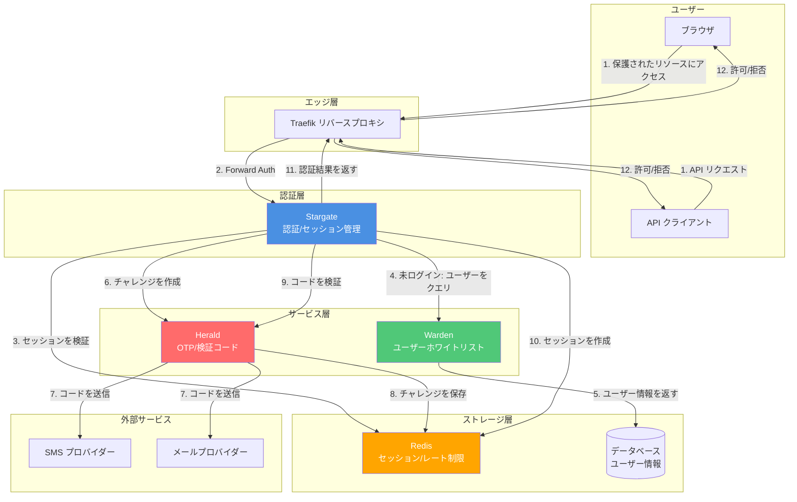

# Stargate アーキテクチャドキュメント

このドキュメントは、Stargate プロジェクトの技術アーキテクチャと設計決定を説明します。

## 技術スタック

- **言語**: Go 1.25
- **Web フレームワーク**: [Fiber v2.52.10](https://github.com/gofiber/fiber)
- **テンプレートエンジン**: [Fiber Template v1.7.5](https://github.com/gofiber/template)
- **セッション管理**: Fiber Session Middleware
- **ログ**: [Logrus v1.9.3](https://github.com/sirupsen/logrus)
- **ターミナル出力**: [Pterm v0.12.82](https://github.com/pterm/pterm)
- **テストフレームワーク**: [Testza v0.5.2](https://github.com/MarvinJWendt/testza)

## プロジェクト構造

```
src/
├── cmd/stargate/          # アプリケーションエントリーポイント
│   ├── main.go            # メイン関数、設定の初期化とサーバーの起動
│   ├── server.go          # サーバー設定とルート設定
│   └── constants.go       # ルートと設定の定数
│
├── internal/              # 内部パッケージ（外部に公開されない）
│   ├── auditlog/          # 監査ログ
│   ├── auth/              # 認証ロジック（パスワード検証、セッション、Warden クライアント）
│   ├── config/            # 設定管理（環境変数、検証、ステップアップ）
│   ├── handlers/          # HTTP リクエストハンドラー（forwardAuth、ログイン、ログアウト、確認コード、TOTP 等）
│   ├── heraldtotp/        # Herald TOTP クライアント
│   ├── i18n/              # 国際化サポート
│   ├── metrics/           # Prometheus メトリクス
│   ├── tracing/           # OpenTelemetry トレーシングミドルウェア
│   └── web/               # Web リソースと HTML テンプレート
```

パスワードとセキュリティのロジックは、`config`（アルゴリズム設定）、`auth`（検証とセッション）、および外部パッケージ（secure-kit、session-kit 等）により提供されます。`internal/secure` や `internal/middleware` のディレクトリはありません。

## 主要コンポーネント

### 1. 認証システム (`internal/auth`)

認証システムは以下を担当します：
- パスワードの検証（複数の暗号化アルゴリズムをサポート）
- セッション管理（作成、検証、破棄）
- 認証状態の検証

**主要関数：**
- `CheckPassword(password string) bool`: パスワードを検証
- `Authenticate(session *session.Session) error`: セッションを認証済みとしてマーク
- `IsAuthenticated(session *session.Session) bool`: セッションが認証されているか確認
- `Unauthenticate(session *session.Session) error`: セッションを破棄

### 2. 設定システム (`internal/config`)

設定システムは以下を提供します：
- 環境変数の管理
- 設定の検証
- デフォルト値のサポート

**設定変数：**
- `AUTH_HOST`: 認証サービスのホスト名（必須）
- `PASSWORDS`: パスワード設定（アルゴリズム:パスワードのリスト）（必須）
- `DEBUG`: デバッグモード（デフォルト: false）
- `LANGUAGE`: インターフェース言語（デフォルト: en、en/zh/fr/it/ja/de/ko をサポート）
- `COOKIE_DOMAIN`: Cookie ドメイン（オプション、クロスドメインセッション共有用）
- `LOGIN_PAGE_TITLE`: ログインページのタイトル（デフォルト: Stargate - Login）
- `LOGIN_PAGE_FOOTER_TEXT`: ログインページのフッターテキスト（デフォルト: Copyright © 2024 - Stargate）
- `USER_HEADER_NAME`: 認証成功後に設定されるユーザーヘッダー名（デフォルト: X-Forwarded-User）
- `PORT`: サービスのリスニングポート（ローカル開発のみ、デフォルト: 80）

### 3. リクエストハンドラー (`internal/handlers`)

ハンドラーは HTTP リクエストの処理を担当します：

- **CheckRoute**: Traefik Forward Auth の認証チェック
- **LoginRoute/LoginAPI**: ログインページとログイン処理
- **LogoutRoute**: ログアウト処理
- **SessionShareRoute**: クロスドメインセッション共有
- **HealthRoute**: ヘルスチェック
- **IndexRoute**: ルートパスの処理

### 4. パスワードとセキュリティ

パスワード検証は `internal/auth` と `internal/config` で行われます。設定でアルゴリズム（plaintext、bcrypt、md5、sha512 等）とパスワードリストを指定し、auth は secure-kit 等の外部機能で検証します。セッションと認証状態は session-kit により提供されます。

## システムアーキテクチャ

### アーキテクチャ図



## スタンドアロン使用モード

Stargateは、外部依存関係なしで完全に独立して使用できるように設計されています：

- **パスワード認証モード**：設定されたパスワードを使用して認証を行い、複数の暗号化アルゴリズムをサポート
- **セッション管理**：Cookieベースのセッション管理、クロスドメインセッション共有をサポート
- **ForwardAuth**：標準のTraefik Forward Authインターフェースを提供

これはStargateの主要な使用ケースで、ほとんどのアプリケーションシナリオに適しています。

## オプションサービス統合

Stargateは認証機能を拡張するためのオプションサービス統合をサポートしています。これらの統合はすべてオプションであり、Stargateは完全に独立して使用できます。

### Warden統合（オプション）

`WARDEN_ENABLED=true`の場合、StargateはWarden SDKを通じてWardenサービスと統合できます：

- **ユーザーホワイトリスト検証**：ユーザーが許可リストに含まれているか確認
- **ユーザー情報取得**：ユーザーのメール、電話、user_id、その他の識別情報を取得
- **ユーザーステータスチェック**：ユーザーアカウントがアクティブかどうかを確認

**統合方法：**
- Warden Go SDKを使用（`github.com/soulteary/warden/pkg/warden`）
- APIキー認証をサポート
- キャッシングをサポート（設定可能なTTL）
- ヘルスチェック統合

**設定要件：**
- `WARDEN_ENABLED=true`
- `WARDEN_URL`を設定する必要があります

### Herald統合（オプション）

`HERALD_ENABLED=true`の場合、StargateはHeraldクライアントを通じてHeraldサービスと統合できます：

- **検証コードチャレンジの作成**：Herald APIを呼び出して検証コードを作成および送信
- **コード検証**：Herald APIを呼び出してユーザーが入力したコードを検証
- **エラー処理**：Heraldが返すさまざまなエラーを処理（期限切れ、ロック、レート制限など）

**統合方法：**
- Herald Goクライアントを使用（`github.com/soulteary/stargate/pkg/herald`）
- APIキー認証をサポート（開発環境）
- HMAC署名認証をサポート（本番環境、推奨）
- mTLSをサポート（オプション）
- ヘルスチェック統合

**設定要件：**
- `HERALD_ENABLED=true`
- `HERALD_URL`を設定する必要があります
- `HERALD_API_KEY`または`HERALD_HMAC_SECRET`のいずれかを設定する必要があります

**セキュリティ要件（本番環境）：**
- サービス間通信はHMAC署名またはmTLSの使用を推奨
- タイムスタンプ検証（リプレイ攻撃を防止）
- リクエスト署名検証

## ワークフロー

### ForwardAuth認証フロー（メインパス）

1. **ユーザーが保護されたリソースにアクセス**
   - Traefikがリクエストをインターセプト
   - Stargateエンドポイント `/_auth` に転送

2. **Stargateが認証を検証**
   - まず `Stargate-Password` ヘッダーを確認（API認証）
   - ヘッダー認証が失敗した場合、`stargate_session_id` Cookieを確認（Web認証）
   - **セッションのみを検証し、外部サービスを呼び出さない**（高性能を保証）

3. **認証成功**
   - `X-Forwarded-User` ヘッダー（または設定されたユーザーヘッダー名）にユーザー情報を設定
   - 200 OKを返す
   - Traefikがリクエストの継続を許可

4. **認証失敗**
   - HTMLリクエスト：ログインページにリダイレクト (`/_login?callback=<originalURL>`)
   - APIリクエスト（JSON/XML）：401 Unauthorizedを返す

### パスワード認証ログインフロー

1. **ユーザーがログインページにアクセス**
   - `GET /_login?callback=<url>`
   - 既にログインしている場合、セッション交換エンドポイントにリダイレクト
   - ドメインが異なる場合、コールバックをCookie (`stargate_callback`) に保存

2. **ログインフォームの送信**
   - `POST /_login` にパスワードと `auth_method=password`
   - パスワードを検証（設定されたパスワードアルゴリズムを使用）
   - セッションを作成し、Cookieを設定
   - **コールバック取得の優先順位**：
     1. Cookieから（以前に設定されている場合）
     2. フォームデータから
     3. クエリパラメータから
     4. 上記のいずれもなく、元のドメインが認証サービスドメインと異なる場合、元のドメインをコールバックとして使用

3. **セッション交換**
   - コールバックが存在する場合、`{callback}/_session_exchange?id=<session_id>` にリダイレクト
   - `GET /_session_exchange?id=<session_id>`
   - セッションCookieを設定（`COOKIE_DOMAIN` が設定されている場合、指定されたドメインに設定）
   - ルートパス `/` にリダイレクト

### Warden + Herald OTP認証ログインフロー（オプション）

WardenおよびHerald統合が有効な場合、OTP認証を使用できます：

1. **ユーザーがログインページにアクセス**
   - `GET /_login?callback=<url>`
   - ログインフォームを表示（メール/電話番号入力をサポート）

2. **ユーザーが識別子を入力し、検証コードをリクエスト**
   - ユーザーがメールまたは電話番号を入力
   - `POST /_send_verify_code` が検証コードリクエストを送信
   - Wardenが有効な場合：Stargate → Wardenがユーザーをクエリ（ホワイトリスト検証、ステータスチェック）、user_id + email/phoneを取得
   - Heraldが有効な場合：Stargate → Heraldがチャレンジを作成し、検証コード（SMSまたはメール）を送信
   - Heraldがchallenge_id、expires_in、next_resend_inを返す

3. **ユーザーが検証コードを送信**
   - `POST /_login` に検証コードと `auth_method=warden`
   - Heraldが有効な場合：Stargate → Herald verify(challenge_id, code)
   - Heraldがok + user_id（+ オプションのamr/認証強度）を返す

4. **セッション作成**
   - Stargateがセッション（cookie/JWT）を発行
   - Wardenが有効な場合：Wardenからユーザー情報を取得し、セッションクレームに書き込む
   - セッションCookieを設定

5. **セッション交換**
   - コールバックが存在する場合、`{callback}/_session_exchange?id=<session_id>` にリダイレクト
   - 後続のforwardAuthはStargateセッションのみを検証し、高性能を保証

## セキュリティの考慮事項

### セッションセキュリティ

- Cookie は XSS 攻撃を防ぐために `HttpOnly` フラグを使用
- Cookie は CSRF 攻撃を防ぐために `SameSite=Lax` を使用
- Cookie のパスは `/` に設定され、ドメイン全体で使用可能
- セッションの有効期限: 24 時間 (`config.SessionExpiration`)
- カスタム Cookie ドメインをサポート（クロスドメインシナリオ用）
- セッション ID は UUID を使用して生成され、一意性とセキュリティを保証

### パスワードセキュリティ

- 複数の暗号化アルゴリズムをサポート（bcrypt または sha512 の使用を推奨）
- パスワード設定は環境変数経由で渡され、コードに保存されない
- 検証時にパスワードを正規化（スペースを削除し、大文字に変換）

### リクエストセキュリティ

- 認証チェックエンドポイントは 2 つの認証方法をサポート：
  - ヘッダー認証 (`Stargate-Password`): API リクエスト用
  - Cookie 認証: Web リクエスト用
- HTML リクエストと API リクエストを区別し、適切な応答を返す

## 拡張性

### 新しいパスワードアルゴリズムの追加

1. `internal/secure/` に新しいアルゴリズム実装を作成
2. `HashResolver` インターフェースを実装
3. `config/validation.go` にアルゴリズムを登録

### 新しい言語の追加

1. `internal/i18n/i18n.go` に言語定数を追加
2. 翻訳マッピングを追加
3. 設定に言語オプションを追加

### ログインページのカスタマイズ

テンプレートファイル `internal/web/templates/login.html` を変更します。

## パフォーマンスの最適化

- Fiber フレームワークを使用、fasthttp ベースで優れたパフォーマンス
- セッションはメモリに保存され、高速アクセス
- 静的リソースは Fiber の静的ファイルサービス経由で提供
- デバッグモードをサポート、本番環境で無効化可能

## デプロイメントアーキテクチャ

### Docker デプロイメント

- イメージサイズを削減するためのマルチステージビルド
- ビルドステージとして `golang:1.25-alpine` を使用
- セキュリティリスクを最小化するため、実行ステージとして `scratch` ベースイメージを使用
- テンプレートファイルを `src/internal/web/templates` からイメージ内の `/app/web/templates` にコピー
- 依存関係のダウンロードを加速するため、中国ミラーソース (`GOPROXY=https://goproxy.cn`) を使用
- バイナリサイズを削減するため、コンパイル時に `-ldflags "-s -w"` を使用
- アプリケーションは自動的にテンプレートパスを見つける（ローカル開発用に `./internal/web/templates`、本番環境用に `./web/templates` をサポート）

### Traefik 統合

- Forward Auth ミドルウェア経由で統合
- HTTP と HTTPS をサポート
- 複数のドメインとパスルールをサポート

## ログと監視

- ログには Logrus を使用
- デバッグモードをサポート（DEBUG=true）
- すべての重要な操作がログに記録される
- 監視用のヘルスチェックエンドポイントが利用可能

## テスト

- ユニットテストは主要機能をカバー
- テストファイルは各パッケージの `*_test.go` ファイルに配置
- アサーションに `testza` を使用
- テストカバレッジには以下が含まれます：
  - 認証ロジック (`internal/auth/auth_test.go`)
  - 設定検証 (`internal/config/config_test.go`)
  - パスワード暗号化アルゴリズム (`internal/secure/secure_test.go`)
  - HTTP ハンドラー (`internal/handlers/handlers_test.go`)

## データフローとセキュリティ境界

### データフロー

**ログインフローのデータフロー：**
1. ユーザーが識別子（メール/電話）を入力 → Stargate
2. Stargate → Warden：ユーザー情報をクエリ（HMAC/mTLSで保護）
3. Warden → Stargate：user_id、メール、電話、ステータスを返す
4. Stargate → Herald：チャレンジを作成（HMAC/mTLSで保護）
5. Herald → プロバイダー：検証コードを送信（SMS/メール）
6. ユーザーが検証コードを入力 → Stargate
7. Stargate → Herald：コードを検証（HMAC/mTLSで保護）
8. Herald → Stargate：検証結果を返す
9. Stargate：セッションを作成 → Redis

**ForwardAuthデータフロー（メインパス）：**
1. Traefik → Stargate：認証チェックリクエスト
2. Stargate：Redisからセッションを読み取る（またはCookieから解析）
3. Stargate → Traefik：認証結果を返す（2xxまたは401/302）

### セキュリティ境界

- **サービス間通信**：HMAC署名またはmTLSで保護
- **PII保護**：機密情報（メール/電話）はログでマスクされます
- **コードセキュリティ**：Heraldはコードハッシュのみを保存し、平文は保存しません
- **セッションセキュリティ**：セッションIDはUUIDを使用し、CookieはHttpOnlyとSameSiteを使用
- **タイムスタンプ検証**：HMAC署名にはタイムスタンプが含まれ、リプレイ攻撃を防止

## 今後の改善

- [x] Wardenユーザーホワイトリスト認証をサポート
- [x] Herald OTP/検証コードサービス統合をサポート
- [x] Redis外部セッションストレージをサポート
- [x] Prometheusメトリクスのエクスポートを追加
- [ ] より多くのパスワード暗号化アルゴリズムをサポート
- [ ] OAuth2/OpenID Connect をサポート
- [ ] マルチユーザーとロール管理をサポート
- [ ] 管理インターフェースを追加
- [ ] 設定ファイル（YAML/JSON）をサポート
