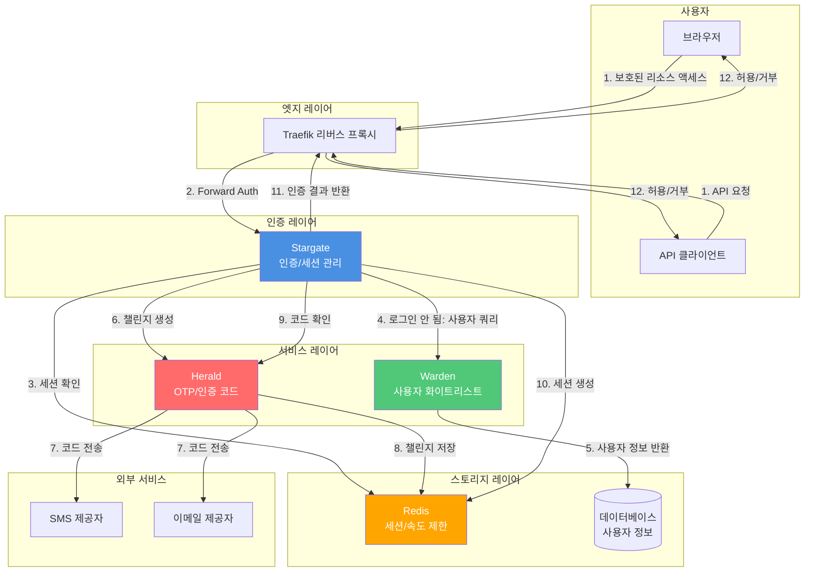

# Stargate 아키텍처 문서

이 문서는 Stargate 프로젝트의 기술 아키텍처와 설계 결정을 설명합니다.

## 기술 스택

- **언어**: Go 1.25
- **웹 프레임워크**: [Fiber v2.52.10](https://github.com/gofiber/fiber)
- **템플릿 엔진**: [Fiber Template v1.7.5](https://github.com/gofiber/template)
- **세션 관리**: Fiber Session Middleware
- **로깅**: [Logrus v1.9.3](https://github.com/sirupsen/logrus)
- **터미널 출력**: [Pterm v0.12.82](https://github.com/pterm/pterm)
- **테스트 프레임워크**: [Testza v0.5.2](https://github.com/MarvinJWendt/testza)

## 프로젝트 구조

```
codes/src/
├── cmd/stargate/          # 애플리케이션 진입점
│   ├── main.go            # 메인 함수, 설정 초기화 및 서버 시작
│   ├── server.go          # 서버 설정 및 라우트 설정
│   └── constants.go       # 라우트 및 설정 상수
│
├── internal/              # 내부 패키지 (외부에 노출되지 않음)
│   ├── auth/              # 인증 로직
│   │   ├── auth.go        # 인증의 주요 기능
│   │   └── auth_test.go   # 인증 테스트
│   │
│   ├── config/            # 설정 관리
│   │   ├── config.go      # 설정 변수 정의 및 초기화
│   │   ├── validation.go  # 설정 검증 로직
│   │   └── config_test.go # 설정 테스트
│   │
│   ├── handlers/          # HTTP 요청 핸들러
│   │   ├── check.go       # 인증 확인 핸들러
│   │   ├── login.go       # 로그인 핸들러
│   │   ├── logout.go      # 로그아웃 핸들러
│   │   ├── session_share.go # 세션 공유 핸들러
│   │   ├── health.go       # 헬스 체크 핸들러
│   │   ├── index.go        # 루트 경로 핸들러
│   │   ├── utils.go        # 핸들러 유틸리티 함수
│   │   └── handlers_test.go # 핸들러 테스트
│   │
│   ├── i18n/              # 국제화 지원
│   │   └── i18n.go        # 다국어 번역
│   │
│   ├── middleware/        # HTTP 미들웨어
│   │   └── log.go         # 로그 미들웨어
│   │
│   ├── secure/            # 비밀번호 암호화 알고리즘
│   │   ├── interface.go   # 암호화 알고리즘 인터페이스
│   │   ├── plaintext.go    # 평문 비밀번호 (테스트만)
│   │   ├── bcrypt.go       # BCrypt 알고리즘
│   │   ├── md5.go          # MD5 알고리즘
│   │   ├── sha512.go       # SHA512 알고리즘
│   │   └── secure_test.go  # 암호화 알고리즘 테스트
│   │
│   └── web/               # 웹 리소스
│       └── templates/     # HTML 템플릿
│           ├── login.html # 로그인 페이지 템플릿
│           └── assets/   # 정적 리소스
│               └── favicon.ico
```

## 주요 컴포넌트

### 1. 인증 시스템 (`internal/auth`)

인증 시스템은 다음을 담당합니다:
- 비밀번호 검증 (여러 암호화 알고리즘 지원)
- 세션 관리 (생성, 검증, 파괴)
- 인증 상태 검증

**주요 함수:**
- `CheckPassword(password string) bool`: 비밀번호 검증
- `Authenticate(session *session.Session) error`: 세션을 인증됨으로 표시
- `IsAuthenticated(session *session.Session) bool`: 세션이 인증되었는지 확인
- `Unauthenticate(session *session.Session) error`: 세션 파괴

### 2. 설정 시스템 (`internal/config`)

설정 시스템은 다음을 제공합니다:
- 환경 변수 관리
- 설정 검증
- 기본값 지원

**설정 변수:**
- `AUTH_HOST`: 인증 서비스 호스트명 (필수)
- `PASSWORDS`: 비밀번호 설정 (알고리즘:비밀번호 목록) (필수)
- `DEBUG`: 디버그 모드 (기본값: false)
- `LANGUAGE`: 인터페이스 언어 (기본값: en, en/zh/fr/it/ja/de/ko 지원)
- `COOKIE_DOMAIN`: Cookie 도메인 (선택 사항, 크로스 도메인 세션 공유용)
- `LOGIN_PAGE_TITLE`: 로그인 페이지 제목 (기본값: Stargate - Login)
- `LOGIN_PAGE_FOOTER_TEXT`: 로그인 페이지 푸터 텍스트 (기본값: Copyright © 2024 - Stargate)
- `USER_HEADER_NAME`: 인증 성공 후 설정되는 사용자 헤더 이름 (기본값: X-Forwarded-User)
- `PORT`: 서비스 리스닝 포트 (로컬 개발만, 기본값: 80)

### 3. 요청 핸들러 (`internal/handlers`)

핸들러는 HTTP 요청 처리를 담당합니다:

- **CheckRoute**: Traefik Forward Auth 인증 확인
- **LoginRoute/LoginAPI**: 로그인 페이지 및 로그인 처리
- **LogoutRoute**: 로그아웃 처리
- **SessionShareRoute**: 크로스 도메인 세션 공유
- **HealthRoute**: 헬스 체크
- **IndexRoute**: 루트 경로 처리

### 4. 비밀번호 암호화 (`internal/secure`)

여러 비밀번호 암호화 알고리즘 지원:
- `plaintext`: 평문 (테스트만)
- `bcrypt`: BCrypt 해시
- `md5`: MD5 해시
- `sha512`: SHA512 해시

모든 알고리즘은 `HashResolver` 인터페이스를 구현합니다:
```go
type HashResolver interface {
    Check(h string, password string) bool
}
```

## 시스템 아키텍처

### 아키텍처 다이어그램



## 독립 사용 모드

Stargate는 외부 종속성 없이 완전히 독립적으로 사용할 수 있도록 설계되었습니다:

- **비밀번호 인증 모드**: 구성된 비밀번호를 사용하여 인증을 수행하며, 여러 암호화 알고리즘을 지원합니다
- **세션 관리**: Cookie 기반 세션 관리, 크로스 도메인 세션 공유를 지원합니다
- **ForwardAuth**: 표준 Traefik Forward Auth 인터페이스를 제공합니다

이것은 Stargate의 주요 사용 사례로, 대부분의 애플리케이션 시나리오에 적합합니다.

## 선택적 서비스 통합

Stargate는 인증 기능을 확장하기 위한 선택적 서비스 통합을 지원합니다. 이러한 통합은 모두 선택 사항이며, Stargate는 완전히 독립적으로 사용할 수 있습니다.

### Warden 통합 (선택 사항)

`WARDEN_ENABLED=true`인 경우, Stargate는 Warden SDK를 통해 Warden 서비스와 통합할 수 있습니다:

- **사용자 화이트리스트 검증**: 사용자가 허용 목록에 있는지 확인
- **사용자 정보 검색**: 사용자의 이메일, 전화, user_id 및 기타 신원 정보 가져오기
- **사용자 상태 확인**: 사용자 계정이 활성 상태인지 확인

**통합 방법:**
- Warden Go SDK 사용 (`github.com/soulteary/warden/pkg/warden`)
- API 키 인증 지원
- 캐싱 지원 (구성 가능한 TTL)
- 헬스 체크 통합

**구성 요구 사항:**
- `WARDEN_ENABLED=true`
- `WARDEN_URL`을 설정해야 합니다

### Herald 통합 (선택 사항)

`HERALD_ENABLED=true`인 경우, Stargate는 Herald 클라이언트를 통해 Herald 서비스와 통합할 수 있습니다:

- **인증 코드 챌린지 생성**: Herald API를 호출하여 인증 코드 생성 및 전송
- **코드 검증**: Herald API를 호출하여 사용자가 입력한 코드 검증
- **오류 처리**: Herald가 반환하는 다양한 오류 처리 (만료, 잠금, 속도 제한 등)

**통합 방법:**
- Herald Go 클라이언트 사용 (`github.com/soulteary/stargate/pkg/herald`)
- API 키 인증 지원 (개발 환경)
- HMAC 서명 인증 지원 (프로덕션 환경, 권장)
- mTLS 지원 (선택 사항)
- 헬스 체크 통합

**구성 요구 사항:**
- `HERALD_ENABLED=true`
- `HERALD_URL`을 설정해야 합니다
- `HERALD_API_KEY` 또는 `HERALD_HMAC_SECRET` 중 하나를 설정해야 합니다

**보안 요구 사항 (프로덕션 환경):**
- 서비스 간 통신은 HMAC 서명 또는 mTLS 사용 권장
- 타임스탬프 검증 (재생 공격 방지)
- 요청 서명 검증

## 워크플로우

### ForwardAuth 인증 플로우 (메인 경로)

1. **사용자가 보호된 리소스에 액세스**
   - Traefik이 요청을 가로챕니다
   - Stargate 엔드포인트 `/_auth`로 전달합니다

2. **Stargate가 인증을 검증**
   - 먼저 `Stargate-Password` 헤더를 확인합니다 (API 인증)
   - 헤더 인증이 실패하면 `stargate_session_id` Cookie를 확인합니다 (웹 인증)
   - **세션만 검증하며 외부 서비스를 호출하지 않습니다** (고성능 보장)

3. **인증 성공**
   - `X-Forwarded-User` 헤더 (또는 구성된 사용자 헤더 이름)에 사용자 정보를 설정합니다
   - 200 OK를 반환합니다
   - Traefik이 요청 계속을 허용합니다

4. **인증 실패**
   - HTML 요청: 로그인 페이지로 리디렉션 (`/_login?callback=<originalURL>`)
   - API 요청 (JSON/XML): 401 Unauthorized 반환

### 비밀번호 인증 로그인 플로우

1. **사용자가 로그인 페이지에 액세스**
   - `GET /_login?callback=<url>`
   - 이미 로그인한 경우, 세션 교환 엔드포인트로 리디렉션합니다
   - 도메인이 다른 경우, 콜백을 Cookie (`stargate_callback`)에 저장합니다

2. **로그인 폼 제출**
   - `POST /_login`에 비밀번호와 `auth_method=password`
   - 비밀번호를 검증합니다 (구성된 비밀번호 알고리즘 사용)
   - 세션을 생성하고 Cookie를 설정합니다
   - **콜백 가져오기 우선순위**:
     1. Cookie에서 (이전에 설정된 경우)
     2. 폼 데이터에서
     3. 쿼리 매개변에서
     4. 위의 항목이 없고 원본 도메인이 인증 서비스 도메인과 다른 경우, 원본 도메인을 콜백으로 사용

3. **세션 교환**
   - 콜백이 있는 경우, `{callback}/_session_exchange?id=<session_id>`로 리디렉션합니다
   - `GET /_session_exchange?id=<session_id>`
   - 세션 Cookie를 설정합니다 (`COOKIE_DOMAIN`이 설정된 경우, 지정된 도메인에 설정)
   - 루트 경로 `/`로 리디렉션합니다

### Warden + Herald OTP 인증 로그인 플로우 (선택 사항)

Warden 및 Herald 통합이 활성화된 경우 OTP 인증을 사용할 수 있습니다:

1. **사용자가 로그인 페이지에 액세스**
   - `GET /_login?callback=<url>`
   - 로그인 폼을 표시합니다 (이메일/전화번호 입력 지원)

2. **사용자가 식별자를 입력하고 인증 코드를 요청**
   - 사용자가 이메일 또는 전화번호를 입력합니다
   - `POST /_send_verify_code`가 인증 코드 요청을 보냅니다
   - Warden이 활성화된 경우: Stargate → Warden이 사용자를 쿼리합니다 (화이트리스트 검증, 상태 확인), user_id + email/phone을 가져옵니다
   - Herald가 활성화된 경우: Stargate → Herald가 챌린지를 생성하고 인증 코드(SMS 또는 이메일)를 보냅니다
   - Herald가 challenge_id, expires_in, next_resend_in을 반환합니다

3. **사용자가 인증 코드를 제출**
   - `POST /_login`에 인증 코드와 `auth_method=warden`
   - Herald가 활성화된 경우: Stargate → Herald verify(challenge_id, code)
   - Herald가 ok + user_id (+ 선택적 amr/인증 강도)를 반환합니다

4. **세션 생성**
   - Stargate가 세션(cookie/JWT)을 발급합니다
   - Warden이 활성화된 경우: Warden에서 사용자 정보를 가져와 세션 클레임에 씁니다
   - 세션 Cookie를 설정합니다

5. **세션 교환**
   - 콜백이 있는 경우, `{callback}/_session_exchange?id=<session_id>`로 리디렉션합니다
   - 후속 forwardAuth는 Stargate 세션만 검증하여 고성능을 보장합니다

## 보안 고려 사항

### 세션 보안

- Cookie는 XSS 공격을 방지하기 위해 `HttpOnly` 플래그 사용
- Cookie는 CSRF 공격을 방지하기 위해 `SameSite=Lax` 사용
- Cookie 경로는 `/`로 설정되어 전체 도메인에서 사용 가능
- 세션 만료 시간: 24시간 (`config.SessionExpiration`)
- 사용자 정의 Cookie 도메인 지원 (크로스 도메인 시나리오용)
- 세션 ID는 UUID를 사용하여 생성되어 고유성과 보안 보장

### 비밀번호 보안

- 여러 암호화 알고리즘 지원 (bcrypt 또는 sha512 사용 권장)
- 비밀번호 설정은 환경 변수를 통해 전달되며 코드에 저장되지 않음
- 검증 시 비밀번호 정규화 (공백 제거, 대문자로 변환)

### 요청 보안

- 인증 확인 엔드포인트는 두 가지 인증 방법을 지원합니다:
  - 헤더 인증 (`Stargate-Password`): API 요청용
  - Cookie 인증: 웹 요청용
- HTML 요청과 API 요청을 구분하여 적절한 응답 반환

## 확장성

### 새로운 비밀번호 알고리즘 추가

1. `internal/secure/`에 새로운 알고리즘 구현 생성
2. `HashResolver` 인터페이스 구현
3. `config/validation.go`에 알고리즘 등록

### 새로운 언어 추가

1. `internal/i18n/i18n.go`에 언어 상수 추가
2. 번역 매핑 추가
3. 설정에 언어 옵션 추가

### 로그인 페이지 사용자 정의

템플릿 파일 `internal/web/templates/login.html`을 수정합니다.

## 성능 최적화

- Fiber 프레임워크 사용, fasthttp 기반으로 우수한 성능
- 세션은 메모리에 저장되어 빠른 액세스
- 정적 리소스는 Fiber의 정적 파일 서비스를 통해 제공
- 디버그 모드 지원, 프로덕션 환경에서 비활성화 가능

## 배포 아키텍처

### Docker 배포

- 이미지 크기 감소를 위한 다단계 빌드
- 빌드 단계로 `golang:1.25-alpine` 사용
- 보안 위험을 최소화하기 위해 실행 단계로 `scratch` 기본 이미지 사용
- 템플릿 파일을 `src/internal/web/templates`에서 이미지 내 `/app/web/templates`로 복사
- 의존성 다운로드 가속을 위해 중국 미러 소스 (`GOPROXY=https://goproxy.cn`) 사용
- 바이너리 크기 감소를 위해 컴파일 시 `-ldflags "-s -w"` 사용
- 애플리케이션은 자동으로 템플릿 경로를 찾습니다 (로컬 개발용 `./internal/web/templates`, 프로덕션용 `./web/templates` 지원)

### Traefik 통합

- Forward Auth 미들웨어를 통해 통합
- HTTP 및 HTTPS 지원
- 여러 도메인 및 경로 규칙 지원

## 로깅 및 모니터링

- 로깅에는 Logrus 사용
- 디버그 모드 지원 (DEBUG=true)
- 모든 중요한 작업이 로깅됨
- 모니터링을 위한 헬스 체크 엔드포인트 사용 가능

## 테스트

- 단위 테스트는 주요 기능을 다룹니다
- 테스트 파일은 각 패키지의 `*_test.go` 파일에 위치
- 어설션에 `testza` 사용
- 테스트 커버리지에는 다음이 포함됩니다:
  - 인증 로직 (`internal/auth/auth_test.go`)
  - 설정 검증 (`internal/config/config_test.go`)
  - 비밀번호 암호화 알고리즘 (`internal/secure/secure_test.go`)
  - HTTP 핸들러 (`internal/handlers/handlers_test.go`)

## 데이터 흐름 및 보안 경계

### 데이터 흐름

**로그인 흐름 데이터 흐름:**
1. 사용자가 식별자(이메일/전화) 입력 → Stargate
2. Stargate → Warden: 사용자 정보 쿼리 (HMAC/mTLS로 보호)
3. Warden → Stargate: user_id, 이메일, 전화, 상태 반환
4. Stargate → Herald: 챌린지 생성 (HMAC/mTLS로 보호)
5. Herald → 제공자: 인증 코드 전송 (SMS/이메일)
6. 사용자가 인증 코드 입력 → Stargate
7. Stargate → Herald: 코드 검증 (HMAC/mTLS로 보호)
8. Herald → Stargate: 검증 결과 반환
9. Stargate: 세션 생성 → Redis

**ForwardAuth 데이터 흐름 (메인 경로):**
1. Traefik → Stargate: 인증 확인 요청
2. Stargate: Redis에서 세션 읽기 (또는 Cookie에서 구문 분석)
3. Stargate → Traefik: 인증 결과 반환 (2xx 또는 401/302)

### 보안 경계

- **서비스 간 통신**: HMAC 서명 또는 mTLS로 보호
- **PII 보호**: 민감한 정보(이메일/전화)는 로그에서 마스킹됩니다
- **코드 보안**: Herald는 코드 해시만 저장하고 평문은 저장하지 않습니다
- **세션 보안**: 세션 ID는 UUID를 사용하고, Cookie는 HttpOnly와 SameSite를 사용합니다
- **타임스탬프 검증**: HMAC 서명에는 타임스탬프가 포함되어 재생 공격을 방지합니다

## 향후 개선 사항

- [x] Warden 사용자 화이트리스트 인증 지원
- [x] Herald OTP/인증 코드 서비스 통합 지원
- [x] Redis 외부 세션 스토리지 지원
- [x] Prometheus 메트릭 내보내기 추가
- [ ] 더 많은 비밀번호 암호화 알고리즘 지원
- [ ] OAuth2/OpenID Connect 지원
- [ ] 다중 사용자 및 역할 관리 지원
- [ ] 관리 인터페이스 추가
- [ ] 설정 파일 (YAML/JSON) 지원
