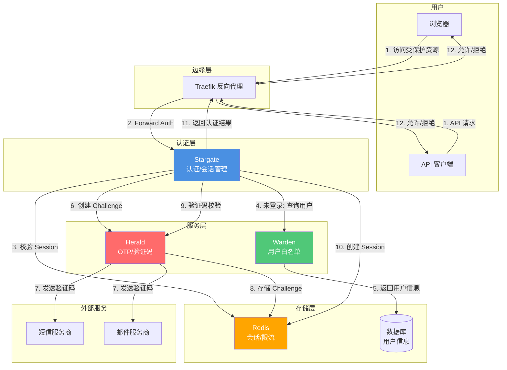

# Stargate 架构文档

本文档描述了 Stargate 项目的技术架构和设计决策。

## 技术栈

- **语言**: Go 1.25
- **Web 框架**: [Fiber v2.52.10](https://github.com/gofiber/fiber)
- **模板引擎**: [Fiber Template v1.7.5](https://github.com/gofiber/template)
- **会话管理**: Fiber Session Middleware
- **日志**: [Logrus v1.9.3](https://github.com/sirupsen/logrus)
- **终端输出**: [Pterm v0.12.82](https://github.com/pterm/pterm)
- **测试框架**: [Testza v0.5.2](https://github.com/MarvinJWendt/testza)

## 项目结构

```
src/
├── cmd/stargate/          # 应用程序入口点
│   ├── main.go            # 主函数，初始化配置和启动服务器
│   ├── server.go          # 服务器配置和路由设置
│   └── constants.go       # 路由和配置常量
│
├── internal/              # 内部包（不对外暴露）
│   ├── auth/              # 认证逻辑
│   │   ├── auth.go        # 认证核心功能
│   │   └── auth_test.go   # 认证测试
│   │
│   ├── config/            # 配置管理
│   │   ├── config.go      # 配置变量定义和初始化
│   │   ├── validation.go  # 配置验证逻辑
│   │   └── config_test.go # 配置测试
│   │
│   ├── handlers/          # HTTP 请求处理器
│   │   ├── check.go       # 认证检查处理器
│   │   ├── login.go       # 登录处理器
│   │   ├── logout.go      # 登出处理器
│   │   ├── session_share.go # 会话共享处理器
│   │   ├── health.go      # 健康检查处理器
│   │   ├── index.go       # 根路径处理器
│   │   ├── utils.go       # 处理器工具函数
│   │   └── handlers_test.go # 处理器测试
│   │
│   ├── i18n/              # 国际化支持
│   │   └── i18n.go        # 多语言翻译
│   │
│   ├── middleware/        # HTTP 中间件
│   │   └── log.go         # 日志中间件
│   │
│   ├── secure/            # 密码加密算法
│   │   ├── interface.go   # 加密算法接口
│   │   ├── plaintext.go   # 明文密码（仅测试）
│   │   ├── bcrypt.go      # BCrypt 算法
│   │   ├── md5.go         # MD5 算法
│   │   ├── sha512.go      # SHA512 算法
│   │   └── secure_test.go # 加密算法测试
│   │
│   └── web/               # Web 资源
│       └── templates/     # HTML 模板
│           ├── login.html # 登录页面模板
│           └── assets/   # 静态资源
│               └── favicon.ico
```

## 核心组件

### 1. 认证系统 (`internal/auth`)

认证系统负责：
- 密码验证（支持多种加密算法）
- 会话管理（创建、验证、销毁）
- 认证状态检查

**关键函数：**
- `CheckPassword(password string) bool`: 验证密码
- `Authenticate(session *session.Session) error`: 标记会话为已认证
- `IsAuthenticated(session *session.Session) bool`: 检查会话是否已认证
- `Unauthenticate(session *session.Session) error`: 销毁会话

### 2. 配置系统 (`internal/config`)

配置系统提供：
- 环境变量管理
- 配置验证
- 默认值支持

**配置变量：**

**基础配置：**
- `AUTH_HOST`: 认证主机名（必需）
- `PASSWORDS`: 密码配置（算法:密码列表）（必需，密码认证模式）
- `DEBUG`: 调试模式（默认：false）
- `LANGUAGE`: 界面语言（默认：en，支持 en/zh）
- `COOKIE_DOMAIN`: Cookie 域名（可选，用于跨域会话共享）
- `LOGIN_PAGE_TITLE`: 登录页面标题（默认：Stargate - Login）
- `LOGIN_PAGE_FOOTER_TEXT`: 登录页面页脚文本（默认：Copyright © 2024 - Stargate）
- `USER_HEADER_NAME`: 认证成功后设置的用户头名称（默认：X-Forwarded-User）
- `PORT`: 服务监听端口（仅本地开发，默认：80）

**Warden 集成配置：**
- `WARDEN_ENABLED`: 启用 Warden 集成（默认：false）
- `WARDEN_URL`: Warden 服务基础 URL
- `WARDEN_API_KEY`: Warden API Key（用于服务认证）
- `WARDEN_CACHE_TTL`: Warden 缓存 TTL（秒，默认：300）

**Herald 集成配置：**
- `HERALD_ENABLED`: 启用 Herald 集成（默认：false）
- `LOGIN_SMS_ENABLED`: 是否允许短信验证码登录（默认：true）
- `LOGIN_EMAIL_ENABLED`: 是否允许邮箱验证码登录（默认：true）
- `HERALD_URL`: Herald 服务基础 URL
- `HERALD_API_KEY`: Herald API Key（开发环境）
- `HERALD_HMAC_SECRET`: Herald HMAC 密钥（生产环境，推荐）
- `HERALD_TLS_CA_CERT_FILE`: Herald TLS CA 证书文件（mTLS）
- `HERALD_TLS_CLIENT_CERT_FILE`: Herald TLS 客户端证书文件（mTLS）
- `HERALD_TLS_CLIENT_KEY_FILE`: Herald TLS 客户端密钥文件（mTLS）
- `HERALD_TLS_SERVER_NAME`: Herald TLS 服务器名称（SNI）

### 3. 请求处理器 (`internal/handlers`)

处理器负责处理 HTTP 请求：

- **CheckRoute**: Traefik Forward Auth 认证检查（仅校验 session）
- **LoginRoute/LoginAPI**: 登录页面和登录处理（支持密码和 Warden+Herald OTP）
- **SendVerifyCodeAPI**: 发送验证码（调用 Herald 创建 challenge）
- **LogoutRoute**: 登出处理
- **SessionShareRoute**: 跨域会话共享
- **HealthRoute**: 健康检查（包含 Warden 和 Herald 健康状态）
- **IndexRoute**: 根路径处理

**健康检查端点说明（避免与下游混淆）：**
- **Stargate**：暴露 `GET /health`，作为自身及聚合健康检查入口。该端点会汇总 Stargate、Redis（若启用会话存储）、以及可选的 Warden / Herald 健康状态。
- **Herald**：健康检查路径为 `GET /healthz`。当启用 Herald 时，Stargate 的 `/health` 会请求 `HERALD_URL/healthz` 以判断 Herald 是否可用。
- **Warden**：健康检查路径为 `GET /health`。当启用 Warden 时，Stargate 的 `/health` 会请求 `WARDEN_URL/health` 以判断 Warden 是否可用。

### 4. 密码加密 (`internal/secure`)

支持多种密码加密算法：
- `plaintext`: 明文（仅用于测试）
- `bcrypt`: BCrypt 哈希
- `md5`: MD5 哈希
- `sha512`: SHA512 哈希

所有算法实现 `HashResolver` 接口：
```go
type HashResolver interface {
    Check(h string, password string) bool
}
```

## 系统架构

### 架构图



### 独立使用模式

Stargate 设计为可以完全独立使用，无需依赖其他服务：

- **密码认证模式**：使用配置的密码进行认证，支持多种加密算法
- **会话管理**：基于 Cookie 的会话管理，支持跨域会话共享
- **ForwardAuth**：提供标准的 Traefik Forward Auth 接口

这是 Stargate 的主要使用场景，适合大多数应用场景。

### 可选服务集成

Stargate 可以选择性地与 Warden 和 Herald 服务集成，以提供更高级的认证功能：

#### Warden 集成（可选）

当启用 Warden 集成时：
- 提供用户白名单管理功能
- 支持基于用户列表的认证
- 提供用户信息查询（email/phone/user_id/status）

#### Herald 集成（可选）

当启用 Herald 集成时：
- 提供 OTP/验证码发送和验证功能
- 支持短信和邮件验证码
- 提供完整的验证码生命周期管理

**注意**：Warden 和 Herald 的集成是可选的。Stargate 可以独立使用，也可以选择性地启用这些集成功能。

## 可选服务集成

Stargate 支持可选的服务集成，以扩展认证功能。这些集成都是可选的，Stargate 可以完全独立使用。

### Warden 集成（可选）

当 `WARDEN_ENABLED=true` 时，Stargate 可以通过 Warden SDK 与 Warden 服务集成：

- **用户白名单验证**：检查用户是否在允许列表中
- **用户信息获取**：获取用户的 email、phone、user_id 等身份信息
- **用户状态检查**：验证用户账户是否处于活跃状态

**集成方式：**
- 使用 Warden Go SDK (`github.com/soulteary/warden/pkg/warden`)
- 支持 API Key 认证
- 支持缓存（可配置 TTL）
- 健康检查集成

**配置要求：**
- `WARDEN_ENABLED=true`
- `WARDEN_URL` 必须设置

### Herald 集成（可选）

当 `HERALD_ENABLED=true` 时，Stargate 可以通过 Herald 客户端与 Herald 服务集成：

- **创建验证码 Challenge**：调用 Herald API 创建并发送验证码
- **验证码校验**：调用 Herald API 验证用户输入的验证码
- **错误处理**：处理 Herald 返回的各种错误（过期、锁定、限流等）

**集成方式：**
- 使用 Herald Go 客户端 (`github.com/soulteary/stargate/pkg/herald`)
- 支持 API Key 认证（开发环境）
- 支持 HMAC 签名认证（生产环境，推荐）
- 支持 mTLS（可选）
- 健康检查集成

**配置要求：**
- `HERALD_ENABLED=true`
- `HERALD_URL` 必须设置
- 必须设置 `HERALD_API_KEY` 或 `HERALD_HMAC_SECRET` 之一

**安全要求（生产环境）：**
- 服务间通信推荐使用 HMAC 签名或 mTLS
- 时间戳校验（防止重放攻击）
- 请求签名验证

## 工作流程

### ForwardAuth 认证流程（主链路）

1. **用户访问受保护资源**
   - Traefik 拦截请求
   - 转发到 Stargate `/_auth` 端点

2. **Stargate 检查认证**
   - 优先检查 `Stargate-Password` 头（API 认证）
   - 如果 Header 认证失败，检查 `stargate_session_id` Cookie（Web 认证）
   - **仅校验 Session，不调用外部服务**（确保高性能）

3. **认证成功**
   - 设置 `X-Forwarded-User` 头（或配置的用户头名称），值为用户信息
   - 返回 200 OK
   - Traefik 允许请求继续

4. **认证失败**
   - HTML 请求：重定向到登录页（`/_login?callback=<原始URL>`）
   - API 请求（JSON/XML）：返回 401 Unauthorized

### 密码认证登录流程

1. **用户访问登录页**
   - `GET /_login?callback=<url>`
   - 如果已登录，重定向到会话交换端点
   - 如果域名不一致，会将 callback 存储在 Cookie 中（`stargate_callback`）

2. **提交登录表单**
   - `POST /_login` 携带密码和 `auth_method=password`
   - 验证密码（使用配置的密码算法）
   - 创建会话并设置 Cookie
   - **Callback 获取优先级**：
     1. 从 Cookie 中获取（如果之前已设置）
     2. 从表单数据中获取
     3. 从查询参数中获取
     4. 如果以上都没有，且来源域名与认证服务域名不一致，则使用来源域名作为 callback

3. **会话交换**
   - 如果有 callback，重定向到 `{callback}/_session_exchange?id=<session_id>`
   - `GET /_session_exchange?id=<session_id>`
   - 设置会话 Cookie（如果配置了 `COOKIE_DOMAIN`，会设置到指定域名）
   - 重定向到根路径 `/`

### Warden + Herald OTP 认证登录流程（可选）

当启用了 Warden 和 Herald 集成时，可以使用 OTP 认证：

1. **用户访问登录页**
   - `GET /_login?callback=<url>`
   - 显示登录表单（支持邮箱/手机号输入）

2. **用户输入标识并请求验证码**
   - 用户输入邮箱或手机号
   - `POST /_send_verify_code` 发送验证码请求
   - 如果启用了 Warden：Stargate → Warden 查询用户（白名单验证、状态检查），获得 user_id + email/phone
   - 如果启用了 Herald：Stargate → Herald 创建 challenge 并发送验证码（SMS 或 Email）
   - Herald 返回 challenge_id、expires_in、next_resend_in

3. **用户提交验证码**
   - `POST /_login` 携带验证码和 `auth_method=warden`
   - 如果启用了 Herald：Stargate → Herald verify(challenge_id, code)
   - Herald 返回 ok + user_id (+ 可选 amr/认证强度)

4. **创建会话**
   - Stargate 签发 session（cookie/JWT）
   - 如果启用了 Warden：从 Warden 获取用户信息并写入 session claims
   - 设置会话 Cookie

5. **会话交换**
   - 如果有 callback，重定向到 `{callback}/_session_exchange?id=<session_id>`
   - 后续 forwardAuth 只校验 Stargate session，确保高性能

## 安全考虑

### 会话安全

- Cookie 使用 `HttpOnly` 标志，防止 XSS 攻击
- Cookie 使用 `SameSite=Lax`，防止 CSRF 攻击
- Cookie 路径设置为 `/`，允许在整个域名下使用
- 会话过期时间：24 小时（`config.SessionExpiration`）
- 支持自定义 Cookie 域名（用于跨域场景）
- 会话 ID 使用 UUID 生成，确保唯一性和安全性

### 密码安全

- 支持多种加密算法（推荐使用 bcrypt 或 sha512）
- 密码配置通过环境变量传递，不存储在代码中
- 密码验证时进行规范化处理（去除空格、转大写）

### 请求安全

- 认证检查端点支持两种认证方式：
  - Header 认证（`Stargate-Password`）：用于 API 请求
  - Cookie 认证：用于 Web 请求
- 区分 HTML 和 API 请求，返回适当的响应

## 扩展性

### 添加新的密码算法

1. 在 `internal/secure/` 创建新的算法实现
2. 实现 `HashResolver` 接口
3. 在 `config/validation.go` 中注册算法

### 添加新的语言

1. 在 `internal/i18n/i18n.go` 中添加语言常量
2. 添加翻译映射
3. 在配置中添加语言选项

### 自定义登录页面

修改 `internal/web/templates/login.html` 模板文件。

## 性能优化

- 使用 Fiber 框架，基于 fasthttp，性能优异
- 会话存储在内存中，访问快速
- 静态资源通过 Fiber 静态文件服务提供
- 支持调试模式，生产环境可关闭

## 部署架构

### Docker 部署

- 多阶段构建，减小镜像体积
- 使用 `golang:1.25-alpine` 作为构建阶段
- 使用 `scratch` 基础镜像作为运行阶段，最小化安全风险
- 模板文件从 `src/internal/web/templates` 复制到镜像中的 `/app/web/templates`
- 使用国内镜像源（`GOPROXY=https://goproxy.cn`）加速依赖下载
- 编译时使用 `-ldflags "-s -w"` 减小二进制体积
- 应用会自动查找模板路径（支持本地开发的 `./internal/web/templates` 和生产环境的 `./web/templates`）

### Traefik 集成

- 通过 Forward Auth 中间件集成
- 支持 HTTP 和 HTTPS
- 支持多域名和路径规则

## 日志和监控

- 使用 Logrus 进行日志记录
- 支持调试模式（DEBUG=true）
- 所有关键操作都有日志记录
- 健康检查端点可用于监控

## 测试

- 单元测试覆盖核心功能
- 测试文件位于各包的 `*_test.go` 文件中
- 使用 `testza` 进行断言
- 测试覆盖的模块：
  - 认证逻辑（`internal/auth/auth_test.go`）
  - 配置验证（`internal/config/config_test.go`）
  - 密码加密算法（`internal/secure/secure_test.go`）
  - HTTP 处理器（`internal/handlers/handlers_test.go`）

## 数据流与安全边界

### 数据流

**登录流程数据流：**
1. 用户输入标识（email/phone）→ Stargate
2. Stargate → Warden：查询用户信息（HMAC/mTLS 保护）
3. Warden → Stargate：返回 user_id、email、phone、status
4. Stargate → Herald：创建 challenge（HMAC/mTLS 保护）
5. Herald → Provider：发送验证码（SMS/Email）
6. 用户输入验证码 → Stargate
7. Stargate → Herald：验证码校验（HMAC/mTLS 保护）
8. Herald → Stargate：返回验证结果
9. Stargate：创建 session → Redis

**ForwardAuth 数据流（主链路）：**
1. Traefik → Stargate：认证检查请求
2. Stargate：从 Redis 读取 session（或从 Cookie 解析）
3. Stargate → Traefik：返回认证结果（2xx 或 401/302）

### 安全边界

- **服务间通信**：使用 HMAC 签名或 mTLS 保护
- **PII 保护**：敏感信息（email/phone）在日志中脱敏
- **验证码安全**：Herald 只存储验证码 hash，不存储明文
- **会话安全**：Session ID 使用 UUID，Cookie 使用 HttpOnly 和 SameSite
- **时间戳校验**：HMAC 签名包含时间戳，防止重放攻击

## 未来改进方向

- [x] 支持 Warden 用户白名单认证
- [x] 支持 Herald OTP/验证码服务集成
- [x] 支持 Redis 外部会话存储
- [x] 添加 Prometheus 指标导出
- [ ] 支持更多密码加密算法
- [ ] 支持 OAuth2/OpenID Connect
- [ ] 支持多用户和角色管理
- [ ] 添加管理界面
- [ ] 支持配置文件（YAML/JSON）
